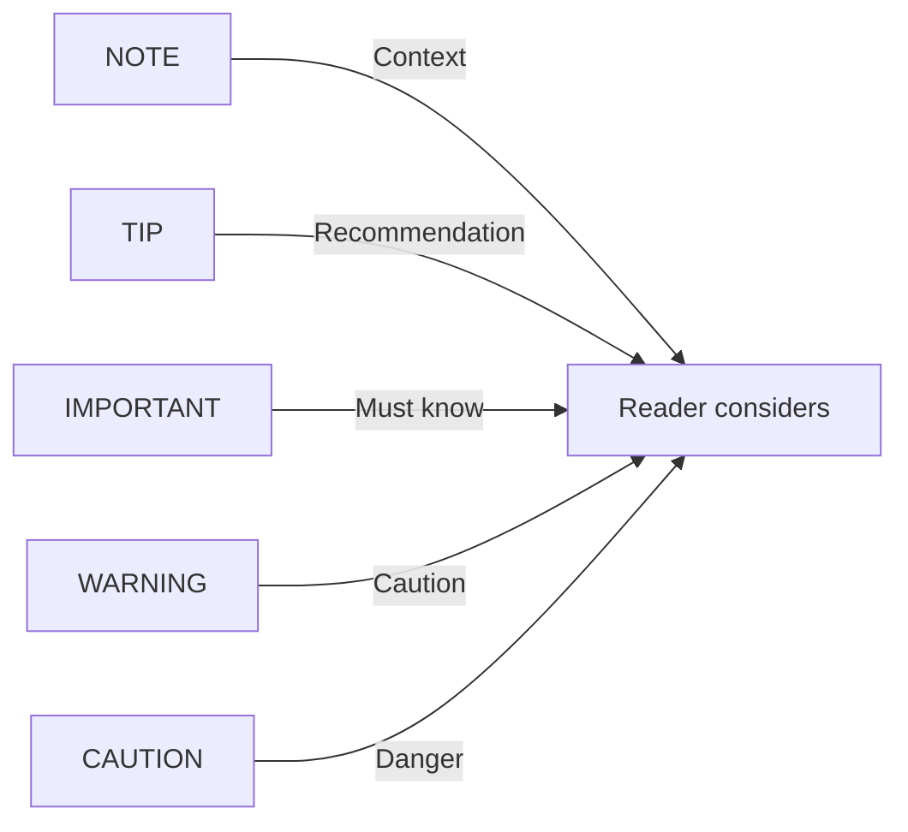

---
# # M.1 Core Identity [IDENTITY]
#
#   Document identification and classification.
#   Defines who this document is and what role it plays.
#
#   key:   [B-path-to-file] — Unique identifier (bereshit keying format)
#   title: [Descriptive title]
#   type:  Standard | Guide | Template | Reference | Index | Policy | Specification | Report
#
key: B-word-seed-doc-markdown-base
title: "[TITLE]"
type: "[TYPE]"

# # M.2 Lifecycle State [STATE]
#
#   Current status and version tracking.
#   Tracks when document was created, updated, and its maturity.
#
#   status:  Draft | Active | Deprecated | Archived
#   version: [a|b|c]-[PHASE].[COMPLETION] — (a) unstable, (b) baseline, (c) stable
#   created: YYYY-MM-DD
#   updated: YYYY-MM-DD
#
status: "[STATUS]"
version: "a-01.00"
created: "[DATE]"
updated: "[DATE]"

# # M.3 Attribution [ATTRIBUTION]
#
#   Authorship and organizational ownership.
#   Credits who created the document and under what collaboration.
#
#   authors:      [Name (Role), ...]
#   organization: [Company]
#   cpi_si:       [Instance] — [Generated | Dictated | Collaboration]
#   copyright:    [© YYYY Company. All rights reserved.]
#
authors: "[Seanje Lenox-Wise (Architect), Nova Dawn (Author)]"
organization: "CreativeWorkzStudio LLC"
cpi_si: "[Instance — Collaboration]"
copyright: "© [YYYY] CreativeWorkzStudio LLC. All rights reserved."

# # M.4 Location [LOCATION]
#
#   File path within the project.
#   Where this document lives in the repository structure.
#
#   path: [relative/path/to/file]
#
path: "cornerstone/templates/documentation/markdown/base.md"

# # M.5 Derivation [DERIVATION]
#
#   Template lineage and inheritance.
#   Traces where this document came from in the template chain.
#
#   derives_from: [path/to/parent/template] — file lineage (pragma meta.from = spec)
#
derives_from: "bereshit/word/seed/documentation/md/markdown-base.md"

# # M.6 Classification [CLASSIFICATION]
#
#   Keywords for discovery and categorization.
#   How to find this document when searching the codebase.
#
#   tags:     [keyword, keyword, ...] — discovery and categorization
#   keywords: [keywords] — HTML meta for search engines
#
tags: "[TAGS]"
keywords: "[KEYWORDS]"

# # M.7 Intent [INTENT]
#
#   Why this document exists and what it enables.
#   The purpose, audience, and key value provided.
#
#   purpose:     [Enables X for Y] — one-line purpose statement
#   description: [Description] — HTML meta for search engines
#
purpose: "[PURPOSE]"
description: "[DESCRIPTION]"

# # M.8 Grounding [GROUNDING]
#
#   Biblical foundation for this document's purpose.
#   Dig deeper — find the verse that best fits THIS document's specific content.
#
#   scripture: [Book Chapter:Verse] — Primary verse
#   verse_text: "[text]" — Verse text for display
#   principle: [Kingdom principle] — Bridge between Scripture and purpose
#   anchor: [Book Chapter:Verse] — Secondary grounding verse
#
scripture: "[Book Chapter:Verse]"
verse_text: "[Verse text]"
principle: "[Kingdom principle connecting Scripture to document purpose]"
anchor: "[Book Chapter:Verse]"

# # M.9 Strictness [STRICTNESS]
#
#   Template adherence level.
#   How closely documents must follow this template's structure.
#
#   strictness: T (Tight) | G (Guided) | F (Free)
#
strictness: "G"

# # M.10 Roadmap [ROADMAP]
#
#   Past, present, and future of this document.
#   History of changes, current state, and planned additions.
#
#   history: [Past changes — version notes]
#   current: [What this document provides now]
#   planned: [Future additions]
#
history: "[Version history]"
current: "[Current state description]"
planned: "[Planned additions]"
---

<!--
#!omni template --md

#_omni ═══════════════════════════════════════════════════════════════════════
#_omni OMNICODE CORE — Universal (every file has these)
#_omni ═══════════════════════════════════════════════════════════════════════
#!omni meta.key = CORNERSTONE-TEMPLATE-DOC-MARKDOWN-BASE
#!omni meta.from = bereshit/word/omni/seed/B-word-omni-seed-documentation.omni
#!omni meta.at = template

#_omni ═══════════════════════════════════════════════════════════════════════
#_omni TYPE FAMILY — Documentation > Markdown (5-block structure)
#_omni ═══════════════════════════════════════════════════════════════════════
#~omni meta.type = documentation
#~omni meta.subtype = markdown
#~omni meta.role = template
#~omni meta.structure = 5-block

#_omni ═══════════════════════════════════════════════════════════════════════
#_omni INSTANCE SCHEMA — Template declares what documents provide
#_omni ═══════════════════════════════════════════════════════════════════════
#:omni meta.category = [category_name]
#:omni meta.scope = [global | local | feature]

#_omni ═══════════════════════════════════════════════════════════════════════
#_omni base.md — Markdown Documentation Template
#_omni Schema for 5-block markdown documents — PhD rigor + Bible accessibility
#_omni ═══════════════════════════════════════════════════════════════════════

═══════════════════════════════════════════════════════════════════════════════
METADATA BLOCK [METADATA]
═══════════════════════════════════════════════════════════════════════════════

5-Block Documentation Structure: Identity and context for this document
YAML front matter — parseable by tools, minimally rendered

Section order: Identity → State → Attribution → Location → Derivation → Classification → Intent → Grounding → Strictness → Roadmap
Flow: who → when → by whom → where → from what → tagged as → why → grounded in → how strict → going where

TEMPLATE USAGE: cp base.md dest → change pragma (template → document) → fill brackets block-by-block

═══════════════════════════════════════════════════════════════════════════════
END METADATA
═══════════════════════════════════════════════════════════════════════════════
-->

<!--
═══════════════════════════════════════════════════════════════════════════════
HEADER BLOCK [HEADER]
═══════════════════════════════════════════════════════════════════════════════

5-Block Documentation Structure: The document's visual identity
What readers see FIRST — the "cover" of your document

Section order: Title → Epigraph → Lead → Abstract → Status → Navigation
Flow: identity → grounding → hook → facts → state → navigation

DESIGN PRINCIPLE: In 5 seconds, readers should know: What is this? Is it current? Is it for me?
This is RENDERED content — visible identity, not just metadata.

═══════════════════════════════════════════════════════════════════════════════
-->

<!-- # H.1 Title [TITLE]

     Document title and visual identity.
     The first thing readers see — establishes what this document is.

     Format: # {title}
     Optional: Logo/image for branded documents
-->
<div align="center">

<!-- Optional logo/image for branded documents

-->

# [Title]

<!-- # H.2 Epigraph [EPIGRAPH]

     Scripture grounding for the document.
     Establishes biblical foundation — connects purpose to eternal truth.

     Source: Use scripture and verse_text from M.8 Grounding
     Format: *"[Verse text]"* — **[Book Chapter:Verse]**
-->
*"[Verse text from METADATA]"* — **[Book Chapter:Verse]**

<!-- # H.3 Lead [LEAD]

     The hook — centered purpose statement.
     Reader decides in 5 seconds: Is this document for me?

     Pattern: "The [thing] for [purpose]" or "[Verb]ing [outcome]"
     Format: **[One-line tagline]**
-->
**[One-line tagline describing what this enables or does]**

<!-- # H.4 Abstract [ABSTRACT]

     Key facts at a glance — visual scanning in 5 seconds.
     Badges provide instant visual status for quick assessment.

     Badge colors:
       Status:  brightgreen (Active), yellow (Draft), red (Deprecated)
       Version: blue (standard)
       Type:    purple, orange, or other distinguishing color
-->


<!-- Optional additional badges


-->

<!-- # H.5 Status [STATUS]

     Document data table — key metadata at a glance.
     Adapt columns for document type; common columns shown below.

     Columns: Status | Version | Type | Created | Updated | [Specialized]
-->

| Status   | Version   | Type   | Created | Updated |
|:--------:|:---------:|:------:|:-------:|:-------:|
| [STATUS] | [VERSION] | [TYPE] | [DATE]  | [DATE]  |

---

<!-- # H.6 Navigation [NAVIGATION]

     Quick links to major document sections.
     Helps readers jump directly to what they need.

     Adapt: Match anchors to actual section structure
     Styles: kbd buttons OR bullet separators (•)
-->
<kbd>[Overview](#overview)</kbd> <kbd>[Elements](#markdown-elements)</kbd> <kbd>[Patterns](#documentation-patterns)</kbd> <kbd>[Reference](#quick-reference)</kbd>

<!-- Alternative bullet separator style:
**[Overview](#overview)** • **[Elements](#markdown-elements)** • **[Patterns](#documentation-patterns)** • **[Reference](#quick-reference)**
-->

</div>

---

<!--
═══════════════════════════════════════════════════════════════════════════════
END HEADER
═══════════════════════════════════════════════════════════════════════════════
-->

<!--
═══════════════════════════════════════════════════════════════════════════════
CONTEXT BLOCK [CONTEXT]
═══════════════════════════════════════════════════════════════════════════════

5-Block Documentation Structure: Preparation before content
What readers need to understand BEFORE the main content

Section order: Overview → Audience → Scope → Prerequisites → Key Terms → Quick Start → Contents → Return
Flow: what → who → boundaries → needs → vocabulary → action → map → back

DESIGN PRINCIPLE: Prepares understanding — context before content.
Layer for different readers:
  Scan:  Overview paragraph tells them what this is
  Skim:  Table shows what's here and who it serves
  Read:  They continue to Content block

═══════════════════════════════════════════════════════════════════════════════
-->

<!-- # C.1 Overview [OVERVIEW]

     Brief description of what this document covers.
     Answer: What is this? Why should I care?

     Length: 2-4 sentences — concise orientation
     Test: Reader knows if they're in the right place
-->
## Overview

[Brief description of what this document covers and why it matters to the reader]

This document follows the <abbr title="CreativeWorkzStudio LLC">CWS</abbr> 5-block documentation structure[^structure].

> [!IMPORTANT]
> **[<mark>Critical concept</mark> or distinction readers MUST understand before proceeding]**

<!-- # C.2 Audience [AUDIENCE]

     Target readers and what they get from this document.
     Helps readers self-select — am I in the right place?

     Format: Table mapping Role → Value received
     Optional: [Reserved: implicit from context] if obvious
-->
### Audience

| Role         | What They Get                      |
|--------------|------------------------------------|
| **[Role 1]** | [What they get from this document] |
| **[Role 2]** | [What they get from this document] |
| **[Role 3]** | [What they get from this document] |

<!-- # C.3 Scope [SCOPE]

     What IS and ISN'T covered by this document.
     Prevents wasted time — sets clear boundaries.

     Format: Two-column table (✓ In Scope | ✗ Out of Scope)
-->
### Scope

| ✓ In Scope        | ✗ Out of Scope       |
|-------------------|----------------------|
| [What IS covered] | [What ISN'T covered] |
| [What IS covered] | [What ISN'T covered] |

<!-- # C.4 Prerequisites [PREREQUISITES]

     What readers need before proceeding.
     Sets expectations for required knowledge or setup.

     Format: Table mapping Requirement → Description
-->
### Prerequisites

| Requirement       | Description   |
|-------------------|---------------|
| **[Requirement]** | [Description] |
| **[Requirement]** | [Description] |

<!-- # C.5 Key Terms [KEY_TERMS]

     Vocabulary readers will encounter in this document.
     Prevents confusion — defines terms before they appear.

     Format: Collapsible table mapping Term → Definition
     Tip: Use <abbr> for inline definitions in content
-->
<details>
<summary><h3>Key Terms</h3></summary>

| Term         | Definition   |
|--------------|--------------|
| **[Term 1]** | [Definition] |
| **[Term 2]** | [Definition] |

</details>

---

<!-- # C.6 Quick Start [QUICK_START]

     Get started quickly — for doers who want to act immediately.
     Provides immediate value without reading everything.

     Format: Code block with numbered steps (emoji comments)
     Test: Reader can follow steps without reading other sections
-->
### Quick Start

```bash
# 1️⃣ First step description
command-here arg1 arg2

# 2️⃣ Second step description
another-command --flag

# 3️⃣ Third step description
final-command
```

---

<!-- # C.7 Contents [CONTENTS]

     Document contents overview — what readers will find here.
     Provides a map before diving into the content.

     Format: Table mapping Category → Content → Audience
     Follow: Include auto-generated Table of Contents (doctoc)
-->
### What This Document Provides

| Category            | What You'll Find         | Who It Serves     |
|---------------------|--------------------------|-------------------|
| **[Category Name]** | [Description of content] | [Target audience] |
| **[Category Name]** | [Description of content] | [Target audience] |
| **[Category Name]** | [Description of content] | [Target audience] |

---

### Table of Contents

<!-- Navigation map for the document
     Auto-generate with: doctoc filename.md --notitle
-->

<!-- START doctoc generated TOC please keep comment here to allow auto update -->
<!-- DON'T EDIT THIS SECTION, INSTEAD RE-RUN doctoc TO UPDATE -->

- [Title](#title)
  - [Overview](#overview)
    - [Audience](#audience)
    - [Scope](#scope)
    - [Prerequisites](#prerequisites)
    - [Quick Start](#quick-start)
    - [What This Document Provides](#what-this-document-provides)
    - [Table of Contents](#table-of-contents)
  - [Markdown Elements](#markdown-elements)
  - [How Markdown Works](#how-markdown-works)
  - [Documentation Patterns](#documentation-patterns)
  - [Quick Reference](#quick-reference)
  - [Biblical Foundation](#biblical-foundation)
  - [References](#references)
  - [See Also](#see-also)

<!-- END doctoc generated TOC please keep comment here to allow auto update -->

<!-- # C.8 Return [RETURN]

     Navigation back to the top of the document.
     Provides closure for the Context block.

     Format: Link with ↑ symbol pointing to title anchor
-->
[↑ Back to Top](#title)

---

<!--
═══════════════════════════════════════════════════════════════════════════════
END CONTEXT
═══════════════════════════════════════════════════════════════════════════════
-->

<!--
═══════════════════════════════════════════════════════════════════════════════
CONTENT BLOCK [CONTENT]
═══════════════════════════════════════════════════════════════════════════════

5-Block Documentation Structure: The actual value — "the chapters"
What readers came for — the substance of the document

Section order: Definition → Operations → Application → Reference
Flow: what → does → how → lookup

SECTION ROLES:
  T.1 DEFINITION  — What this is (Types, Systems, Structure, About)
  T.2 OPERATIONS  — What it does (Functions, Files, Behaviors)
  T.3 APPLICATION — How to use it (Patterns, Examples, Running)
  T.4 REFERENCE   — Quick lookup (Tables, Summaries, Next Steps)

DESIGN PRINCIPLE: Layer for different readers
  Scan:  headings + tables
  Read:  explanations
  Study: collapsibles
TOOLKIT: ##Sections, ###Subsections, tables, code, collapsibles, callouts

═══════════════════════════════════════════════════════════════════════════════
-->

<!-- # T.1 Definition [DEFINITION]

     What this is — concepts, types, structure.
     Establishes foundational understanding before diving into operations.

     Headings: Types | Systems | Structure | About
     Elements: tables, collapsibles, > [!TIP]
-->
## Markdown Elements

Markdown organizes content into three fundamental element types: **block**, **inline**, and **structural**. Understanding these categories is the foundation for creating well-structured documents.

| Element Type | Description | Examples |
|--------------|-------------|----------|
| **Block** | Self-contained content units separated by blank lines | Paragraphs, tables, code blocks, callouts, collapsibles |
| **Inline** | Formatting applied within text flow, no line breaks | Bold, italic, links, footnotes, `<kbd>` shortcuts |
| **Structural** | Document organization and metadata | Headings, YAML front matter, anchors, HTML comments |

<details open>
<summary><h3>Block Elements: The Building Blocks</h3></summary>

Block elements are the primary containers for content. Each block type serves a specific purpose:

| Block | Purpose | Syntax |
|-------|---------|--------|
| **Paragraph** | Default text container | (just text with blank lines) |
| **Table** | Structured data in rows/columns | `\| Header \|` with `\|---\|` separator |
| **Code Block** | Syntax-highlighted code | ` ``` ` + language name |
| **Callout** | GitHub Alert boxes | `> [!NOTE]`, `> [!TIP]`, etc. |
| **Collapsible** | Expandable sections | `<details>` + `<summary>` |
| **Blockquote** | Quoted text | `>` prefix |
| **List** | Ordered/unordered items | `1.` or `-` prefix |

> [!TIP]
> **Block separation matters.** Blocks need blank lines between them. Without blank lines, Markdown may combine elements unexpectedly.

[↑ Back to Top](#title)

</details>

<details open>
<summary><h3>Inline Elements: Text-Level Formatting</h3></summary>

Inline elements modify text without breaking flow. They're applied within paragraphs and other blocks:

| Format | Syntax | Result |
|--------|--------|--------|
| **Bold** | `**text**` | **text** |
| **Italic** | `*text*` | *text* |
| **Bold+Italic** | `***text***` | ***text*** |
| **Code** | `` `code` `` | `code` |
| **Strikethrough** | `~~text~~` | ~~text~~ |
| **Link** | `[text](url)` | [text](#) |

**HTML inline elements** (extend Markdown's capabilities):

| Element | Syntax | Result |
|---------|--------|--------|
| **Highlight** | `<mark>text</mark>` | <mark>text</mark> |
| **Keyboard** | `<kbd>key</kbd>` | <kbd>Ctrl</kbd>+<kbd>C</kbd> |
| **Abbreviation** | `<abbr title="full">ABBR</abbr>` | <abbr title="Example">EX</abbr> |
| **Superscript** | `<sup>2</sup>` | x<sup>2</sup> |
| **Subscript** | `<sub>2</sub>` | H<sub>2</sub>O |

[↑ Back to Top](#title)

</details>

<details>
<summary><h3>Structural Elements: Document Architecture</h3></summary>

Structural elements define how the document is organized and connected:

| Element | Purpose | Syntax |
|---------|---------|--------|
| **Headings** | Hierarchical sections | `#` to `######` |
| **YAML Front Matter** | Document metadata | `---` delimited block at top |
| **Anchors** | Navigation targets | `{#anchor-id}` or auto from headings |
| **Links** | Cross-references | `[text](#anchor)` |
| **Comments** | Hidden notes | `<!-- comment -->` |
| **Horizontal Rule** | Section dividers | `---` or `***` |

> [!IMPORTANT]
> **Anchors enable navigation.** Every heading automatically creates an anchor from its text (lowercase, hyphens for spaces). Use `[text](#heading-text)` to link to any section.

[↑ Back to Top](#title)

</details>

---

<!-- # T.2 Operations [OPERATIONS]

     What it does — functions, behaviors, processes.
     Shows how the system operates and what actions are available.

     Headings: Functions | Files | Behaviors
     Elements: comparison matrix, workflow steps, mermaid diagrams
     Symbols:  ✓ (yes) | ✗ (no) | ○ (optional)
-->
## How Markdown Works

Understanding **how** Markdown elements behave enables you to choose the right tool for each documentation need. This section covers the operational characteristics of key elements.

### Table Behaviors

Tables transform data into scannable, structured information. Key behavioral options:

| Feature | Basic | GitHub | When to Use |
|---------|:-----:|:------:|-------------|
| **Column alignment** | ✓ | ✓ | Always — guides eye movement |
| **Header row** | ✓ | ✓ | Most tables — identifies columns |
| **Cell formatting** | ✓ | ✓ | Bold, italic, code within cells |
| **HTML in cells** | ✗ | ✓ | Complex content, images |
| **Merged cells** | ✗ | ✗ | Use HTML tables if needed |

<details open>
<summary><h4>Table Alignment Syntax</h4></summary>

The separator row controls column alignment:

| Syntax | Alignment | Use For |
|--------|-----------|---------|
| `\|---\|` | Left (default) | Text, descriptions |
| `\|:---:\|` | Center | Status, short values |
| `\|---:\|` | Right | Numbers, counts |

```markdown
| Left | Center | Right |
|------|:------:|------:|
| text | text   |   123 |
```

| Left | Center | Right |
|------|:------:|------:|
| text | text   |   123 |

</details>

### Callout Behaviors (GitHub Alerts)

Callouts create visual interruptions that convey importance. Each type signals different reader response:



| Callout | Conveys | Reader Response |
|---------|---------|-----------------|
| **NOTE** | Additional context, scope clarification | "Good to know" |
| **TIP** | Best practice, recommendation | "I should do this" |
| **IMPORTANT** | Critical concept, must understand | "I need to remember this" |
| **WARNING** | Potential issue, thing to avoid | "Be careful here" |
| **CAUTION** | Serious warning, could cause problems | "Stop and think" |

> [!NOTE]
> **Callout economy:** If everything is important, nothing is. Reserve IMPORTANT and CAUTION for genuinely critical information.

<details>
<summary><h4>Callout Syntax</h4></summary>

```markdown
> [!NOTE]
> Content here. Can span multiple lines.
> Just keep the `>` prefix.

> [!TIP]
> **Bold text** and `code` work inside callouts.
```

</details>

### Collapsible Behaviors

Collapsibles create layered reading experiences — scanners see summaries, readers expand for depth:

| Variant | Behavior | Use For |
|---------|----------|---------|
| `<details open>` | Expanded by default, can collapse | Primary content most readers need |
| `<details>` | Collapsed by default, can expand | Deep dives, optional detail, advanced topics |

<details>
<summary><h4>Collapsible Syntax</h4></summary>

```html
<details open>
<summary><h3>Section Title</h3></summary>

Content here. Markdown works inside.

- Lists work
- **Bold** works
- Tables work

</details>
```

> [!WARNING]
> **Blank lines matter.** Content inside `<details>` needs blank lines before and after for Markdown to render properly.

</details>

[↑ Back to Top](#title)

---

<!-- # T.3 Application [APPLICATION]

     How to use it — patterns, examples, practical application.
     Shows the concepts in action with real-world demonstrations.

     Headings: Usage Patterns | Examples | Running the Demo
     Elements: code blocks, collapsible examples, source links
-->
## Documentation Patterns

Effective documentation combines Markdown elements into patterns that serve specific purposes. These patterns create the **PhD rigor + Bible accessibility** standard — comprehensive enough for scholars, scannable for shepherds.

### Pattern: Layered Reading

Create documents readable at multiple depths. Scanners get value from headings and tables; readers get full explanations; scholars expand collapsibles for deep dives.

```markdown
## Section Title                           <!-- 1️⃣ Scanner sees heading -->

Brief purpose statement in **bold**.       <!-- 2️⃣ Scanner gets context -->

| Term | Definition |                       <!-- 3️⃣ Scanner scans table -->
|------|------------|
| Key  | Value      |

<details open>                             <!-- 4️⃣ Reader sees main content -->
<summary><h3>Detailed Explanation</h3></summary>
Full explanation here...
</details>

<details>                                  <!-- 5️⃣ Scholar expands for depth -->
<summary><h3>Deep Dive: Advanced Topic</h3></summary>
Technical details, edge cases...
</details>
```

<details open>
<summary><h4>Example: This Document</h4></summary>

**Source:** You're reading it.

This template demonstrates layered reading:

| Layer | What They See |
|-------|---------------|
| **Scanner** | Section headings, overview tables, lead paragraphs |
| **Reader** | `<details open>` sections with full explanations |
| **Scholar** | `<details>` deep dives with technical details |

**Key insight:** Every section serves all three audiences simultaneously.

</details>

### Pattern: Navigation & Cross-Reference

Connect document sections so readers can jump to what they need:

```markdown
<!-- At top of document (H.6 Navigation) -->
<kbd>[Overview](#overview)</kbd> <kbd>[Patterns](#patterns)</kbd> <kbd>[Reference](#reference)</kbd>

<!-- Alternative styles -->
**[Overview](#overview)** • **[Patterns](#patterns)** • **[Reference](#reference)**
[Overview](#overview) | [Patterns](#patterns) | [Reference](#reference)

<!-- At section end -->
[↑ Back to Top](#title)
```

<details open>
<summary><h4>Link Types Reference</h4></summary>

| Link Type | Syntax | Use For |
|-----------|--------|---------|
| **Internal anchor** | `[text](#heading-name)` | Same-document navigation |
| **File link** | `[text](path/file.md)` | Other documents |
| **External URL** | `[text](https://...)` | Web resources |
| **Reference-style** | `[text][ref-id]` | Maintainable link management |
| **Back to top** | `[↑ Back to Top](#title)` | Section endings |

</details>

### Pattern: Code Documentation

Document code with syntax highlighting and numbered explanations:

```go
// LoadConfig demonstrates the chain loading pattern
func LoadConfig(root string) (*Config, error) {
    // 1️⃣ Establish base path
    basePath := filepath.Join(root, "word", "core")

    // 2️⃣ Load in dependency order
    primitives, err := loadPrimitives(basePath)
    if err != nil {
        return nil, fmt.Errorf("primitives: %w", err)
    }

    // 3️⃣ Return assembled configuration
    return &Config{Primitives: primitives}, nil
}
```

> [!WARNING]
> **Code block language matters.** Use ` ```go `, ` ```bash `, ` ```markdown ` etc. for proper syntax highlighting. Generic ` ``` ` produces no highlighting.

<details>
<summary><h4>Footnotes for Deep References</h4></summary>

Use footnotes[^1] to provide depth without breaking flow. Readers who want more can scroll to the bottom; others continue uninterrupted.

```markdown
This document follows the 5-block structure[^1].

[^1]: See CWS-STD-006 for complete specification.
```

[^1]: Footnotes render at the bottom of the document automatically.

</details>

[↑ Back to Top](#title)

---

<!-- # T.4 Reference [REFERENCE]

     Quick lookup — tables, summaries, next steps.
     For returning readers who know what they want.

     Headings: Quick Reference | Checklist | Syntax Lookup
     Elements: checklists, lookup tables, > [!CAUTION]
-->
## Quick Reference

Quick lookup tables for returning users. Find syntax fast, verify patterns, check symbols.

### Document Checklist

Before finalizing any Markdown document:

- [ ] All headings follow hierarchy (`#` → `##` → `###`)
- [ ] Tables have header row and alignment specified
- [ ] Code blocks specify language (` ```go ` not just ` ``` `)
- [ ] Callouts use valid types (`[!NOTE]`, `[!TIP]`, `[!IMPORTANT]`, `[!WARNING]`, `[!CAUTION]`)
- [ ] Collapsibles have blank lines inside for Markdown rendering
- [ ] Internal links point to valid heading anchors
- [ ] Reference-style links are defined at document bottom

### Syntax Quick Lookup

| Element | Syntax | Notes |
|---------|--------|-------|
| **Heading** | `## Title` | More `#` = deeper nesting |
| **Bold** | `**text**` | Double asterisks |
| **Italic** | `*text*` | Single asterisks |
| **Code** | `` `code` `` | Backticks |
| **Link** | `[text](#anchor)` | Anchor from heading text |
| **Image** | `` | Exclamation + link syntax |
| **Table** | `\| Col \|` | Pipe-separated, `\|---\|` header |
| **Callout** | `> [!NOTE]` | Five types available |
| **Collapsible** | `<details>` | HTML element, needs blank lines |
| **Footnote** | `[^1]` | Reference defined at bottom |

### Unicode Symbols

| Category | Symbols | Use For |
|----------|---------|---------|
| **Status** | ✓ ✗ ✔ ✘ ☑ ☐ | Completion, yes/no |
| **Arrows** | → ← ↑ ↓ ⇒ ⟶ | Flow, navigation |
| **Bullets** | • ◦ ▸ ► ‣ | Lists, separators |
| **Indicators** | 🟢 🟡 🔴 ○ | Status levels |
| **Numbers** | 1️⃣ 2️⃣ 3️⃣ 4️⃣ 5️⃣ | Numbered steps in code |

> [!CAUTION]
> **Platform rendering varies.** Some Unicode symbols (especially emoji) render differently across GitHub, VS Code, and other platforms. Test in your target environment.

[↑ Back to Top](#title)

---

<!--
═══════════════════════════════════════════════════════════════════════════════
END CONTENT
═══════════════════════════════════════════════════════════════════════════════
-->

<!--
═══════════════════════════════════════════════════════════════════════════════
FOOTER BLOCK [FOOTER]
═══════════════════════════════════════════════════════════════════════════════

5-Block Documentation Structure: Where readers go NEXT
The "appendix" — supporting material, references, and connections

Section order: Biblical → References → See Also → Closing
Flow: truth → resources → connections → summary

SECTION ROLES:
  F.1 BIBLICAL   — Grounding in truth (the WHY beneath)
  F.2 REFERENCES — Links to related docs, standards, resources
  F.3 SEE-ALSO   — Cross-references to ecosystem
  F.4 CLOSING    — Key summary, version, grounding verse

SEND OUT WITH: Truth grounding → Next steps → Ecosystem connection

═══════════════════════════════════════════════════════════════════════════════
-->

<!-- # F.1 Biblical Foundation [BIBLICAL]

     Connect to eternal truth — the WHY beneath the what.
     Grounds the document's purpose in Scripture.

     Content: Scripture verse + context + practical application
     Test: If you can't articulate Scripture's role, reflect on purpose
-->
## Biblical Foundation

<!-- THINKING: Connect the work to eternal truth.
     Not decoration - genuine grounding that informs the document.
     If you can't articulate how Scripture informs this work, reflect on whether
     the document serves Kingdom purposes. -->

[^structure]: The 5-block structure: <abbr title="YAML front matter">METADATA</abbr> → HEADER → CONTEXT → CONTENT → FOOTER. See <abbr title="Standard document key">CWS-STD-006</abbr> for full specification.

> [!NOTE]
> **[Context for why this biblical principle applies to this document's topic]**

*"[Scripture verse that grounds this work]"* — **[Book Chapter:Verse]**

**Applied:** [How this scriptural truth specifically informs this document's approach, structure, or content. Make the connection clear and practical.]

[↑ Back to Top](#title)

---

<!-- # F.2 References [REFERENCES]

     Links to related docs, standards, and resources.
     Helps readers continue their learning journey.

     Organize: By type (Documents | Standards | External)
     Use: Reference-style links at bottom for maintainability
-->

## References

### Related Documents

<!-- THINKING: Documents readers should explore next or alongside this one.
     Use reference-style links [text][ref] for maintainability. -->

| Document                       | Purpose                               |
|--------------------------------|---------------------------------------|
| **[Document Title][ref-doc1]** | [What it covers and why it's related] |
| **[Document Title][ref-doc2]** | [What it covers and why it's related] |

<!-- Reference links defined at bottom of document -->

### Standards & Specifications

<!-- THINKING: Standards this document implements or relates to. -->

| Standard                     | Purpose           |
|------------------------------|-------------------|
| **[CWS-STD-###][std-ref]**   | [What it governs] |
| **[CWS-STD-###][std-ref2]**  | [What it governs] |

### External Resources

<!-- THINKING: External links for further learning. -->

| Resource                     | Purpose            |
|------------------------------|--------------------|
| **[Resource Name][ext-ref]** | [What it provides] |

---

<!-- # F.3 See Also [SEE-ALSO]

     Cross-references to related ecosystem documents.
     Helps readers discover connected knowledge.

     Format: Bullet list with document → brief description
-->
## See Also

- **[Related Document 1]** — [Brief description of relationship]
- **[Related Document 2]** — [Brief description of relationship]
- **[Related Document 3]** — [Brief description of relationship]

---

<!-- # F.4 Closing [CLOSING]

     Key summary, version, and grounding verse.
     Provides closure and key information at a glance.

     Format: Centered div with key/type/version, status, scripture
-->
<div align="center">

**[↑ Back to Top](#title)**

---

**Key:** [DOMAIN-CAT-###] • **Type:** [Type] • **Version:** [X.Y.Z]

**Status:** [Active|Draft|Deprecated] • **Updated:** [YYYY-MM-DD]

---

*"[Biblical foundation verse from METADATA]"* — **[Reference]**

**[One line connecting this work to Kingdom purpose]**

---

<!-- THINKING: Optional company standards navigation
**Company Standards:**
[4-Block Structure](link) • [Document Keying](link) • [Documentation Standards](link)
-->

</div>

<!--
═══════════════════════════════════════════════════════════════════════════════
END FOOTER
═══════════════════════════════════════════════════════════════════════════════
-->

<!--
═══════════════════════════════════════════════════════════════════════════════
REFERENCE LINKS
═══════════════════════════════════════════════════════════════════════════════

R.1-R.3: Document → Standard → External

Reference-style links for maintainability.
If a URL changes, update once here instead of throughout document.
Format: [ref-name]: url "optional title"

═══════════════════════════════════════════════════════════════════════════════
-->

<!-- # R.1 Document References [DOCUMENTS]

     Related documents in the ecosystem
-->
[ref-doc1]: ../path/to/document.md "Related Document 1"
[ref-doc2]: ../path/to/document.md "Related Document 2"

<!-- # R.2 Standard References [STANDARDS]

     CWS standards this document implements or relates to
-->
[std-ref]: ../standards/CWS-STD-001-DOC-4-block.md "4-Block Structure Standard"
[std-ref2]: ../standards/CWS-STD-002-DOC-document-keying.md "Document Keying Standard"

<!-- # R.3 External References [EXTERNAL]

     External resources for further learning
-->
[ext-ref]: https://example.com "External Resource"

<!--
═══════════════════════════════════════════════════════════════════════════════
END REFERENCE LINKS
═══════════════════════════════════════════════════════════════════════════════
-->

<!--
═══════════════════════════════════════════════════════════════════════════════
TEMPLATE NOTES — DELETE WHEN USING
═══════════════════════════════════════════════════════════════════════════════

PRINCIPLE: PhD rigor + Bible accessibility
STRUCTURE: METADATA → HEADER → CONTEXT → CONTENT → FOOTER
WORKFLOW: cp template dest → update pragma → fill brackets block-by-block

5-BLOCK PATTERN:
  METADATA — catalog card (parseable identity)
  HEADER — cover (visible identity in 5 sec)
  CONTEXT — introduction (prepares understanding)
  CONTENT — chapters (value organized)
  FOOTER — appendix (resources + grounding)

OMNICODE MAPPING:
  METADATA ←→ METADATA (identity)
  HEADER ← (doc-specific)
  CONTEXT ←→ SETUP/CONTEXT (preparation)
  CONTENT ←→ BODY/CONTENT (value)
  FOOTER ←→ CLOSING/FOOTER (completion)

LAYERED READING:
  Scan (5s) → Skim (1m) → Read → Study → Reference

TOOLKIT ELEMENTS:
  <abbr> first terms | <mark> emphasis | <kbd> shortcuts
  [text](#anchor) xrefs | ✓✗○ status | → flow
  <details open> major | <details> optional
  > [!NOTE] [!TIP] [!IMPORTANT] [!WARNING] [!CAUTION]

WORKFLOW:
  1. METADATA → identity
  2. HEADER → hook
  3. CONTEXT → preparation
  4. CONTENT → value (use toolkit naturally)
  5. FOOTER → ground + connect
  6. Delete numbered section comments or keep for reference
  7. Delete this TEMPLATE NOTES block

═══════════════════════════════════════════════════════════════════════════════
-->
