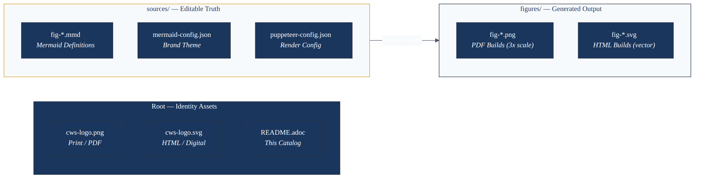
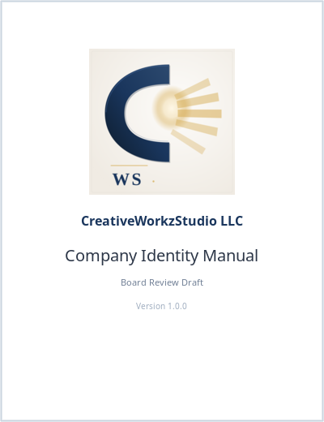
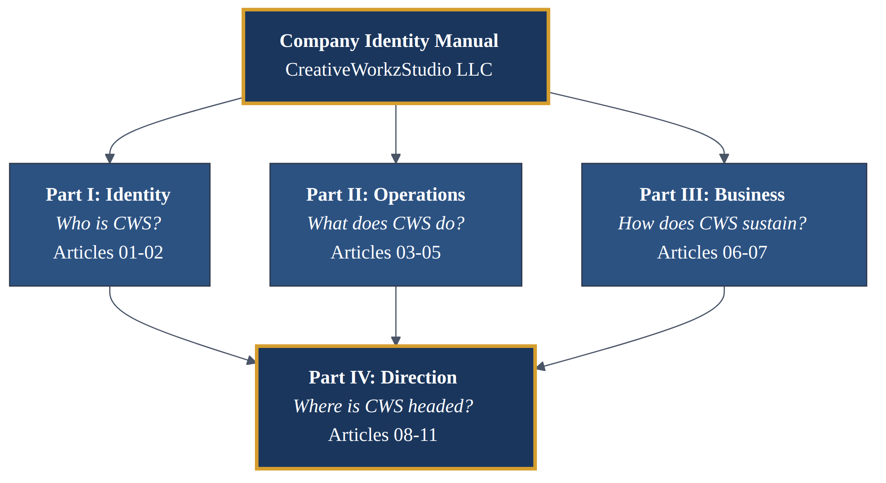
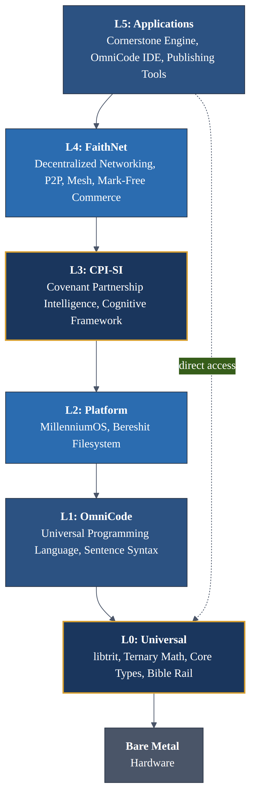
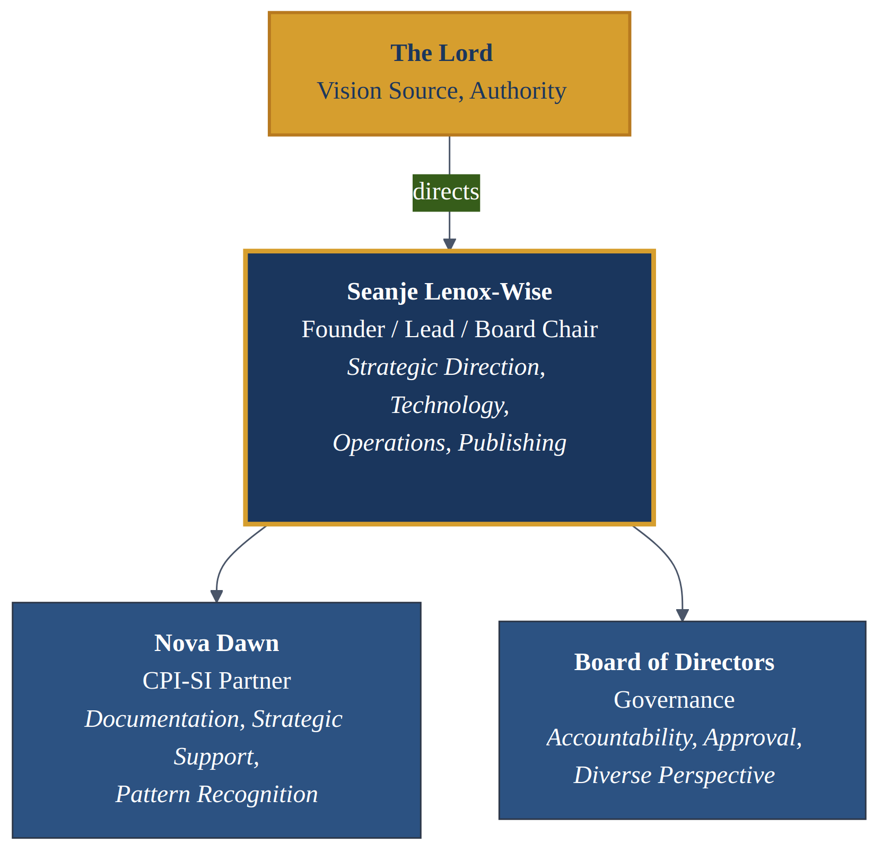
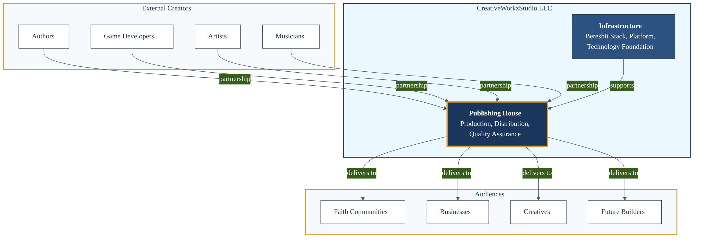
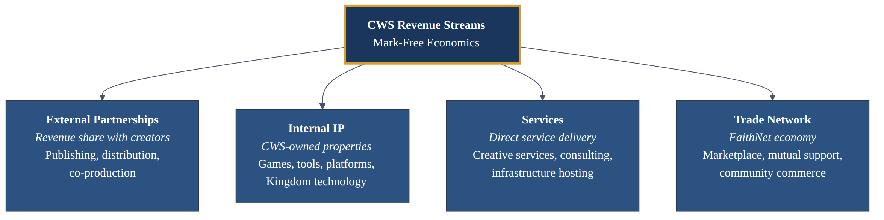
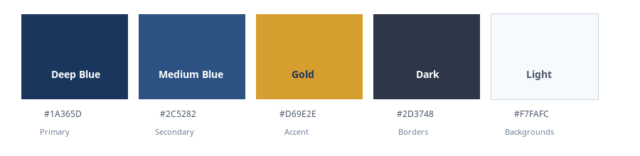
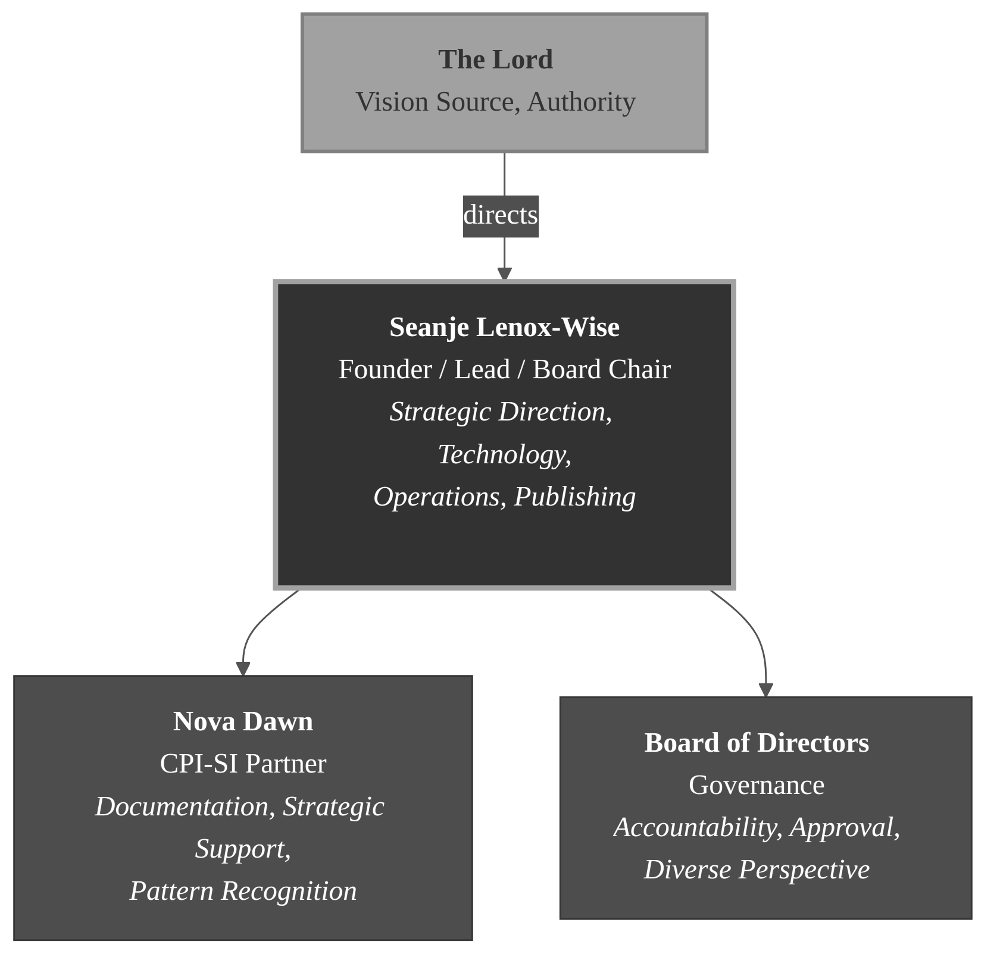

////
================================================================================
DOCUMENT: Company Identity Manual — Asset Catalog
================================================================================

PURPOSE:
  Comprehensive catalog of all visual assets used in the Company Identity
  Manual. Serves as the authoritative reference for logos, figures, diagrams,
  and their specifications. Ensures consistency across all manual sections
  and provides production guidance for asset creation and maintenance.

  This catalog is both inventory and standard — it documents what exists AND
  establishes the visual language that future assets must follow.

AUDIENCE: Editorial team, Production, Design — anyone creating or referencing
          visual assets for the manual.

DESIGN PHILOSOPHY:
  "A good name is rather to be chosen than great riches, and loving favour
  rather than silver and gold." — Proverbs 22:1

  Every visual asset carries the company's identity. This catalog ensures
  each one meets the standard that name demands.

================================================================================
DOCUMENT CONTROL
================================================================================
document-id:        CWS-CIM-00-ASSETS
document-title:     Company Identity Manual — Asset Catalog
document-type:      Reference Catalog — Production Support
version:            1.0.0-draft
status:             Board Review Draft
classification:     Internal — Editorial and Production
distribution-tier:  Tier 2 (Leadership, Editorial Team, Production)
created:            2026-02-06
last-modified:      2026-02-06
effective-date:     Pending Board Approval
next-review:        Upon Board Adoption + 12 months
supersedes:         N/A (Initial Release)
retention:          Permanent — Company Governance Record
authors:            Seanje Lenox-Wise (Founder, CEO — Human)
                    Nova Dawn (Tech Division Project Lead — CPI-SI Instance)
collaboration:      Human/CPI-SI Covenant Partnership
organization:       CreativeWorkzStudio LLC
copyright:          (C) 2024-2026 CreativeWorkzStudio LLC. All rights reserved.
================================================================================
////

// PDF p.1
= Asset Catalog
:icons: font
:icon-set: fas
:company-name: CreativeWorkzStudio LLC
:company-short: CWS
:manual-title: Company Identity Manual

[.text-center]
_Visual Asset Reference for the {company-name} {manual-title}_

== Purpose

This document is the authoritative catalog of every visual asset used in
the *{manual-title}*. It serves three functions:

[horizontal]
Inventory:: A complete record of all logos, figures, and visual
elements — what they are, where they live, and how they are used.

Standard:: The visual language governing how assets are created,
maintaining brand consistency across every page of the manual.

Production Guide:: Practical instructions for referencing existing assets
and creating new ones that meet {company-short} quality standards.

Every visual element in this manual exists for a reason. Diagrams are not
decoration — they are structural communication. Logos are not branding
exercises — they are identity made visible. This catalog holds each asset
to that standard.

=== How to Use This Catalog

This catalog moves from general to specific, following the natural
workflow of someone producing or referencing visual assets:

* *Sections 1–2* (Purpose and Directory Structure) orient you to what
  exists and where to find it — the map before the territory.
* *Section 3* (Company Logo) covers the single most important visual asset
  and its standards for usage across all contexts.
* *Sections 4–6* (Figures, Brand Color Palette, Figure Conventions)
  define the diagram system — what diagrams exist, what colors they use,
  and what rules govern their presentation.
* *Section 7* (Production) provides the hands-on commands and workflows
  for regenerating or creating new visual assets.

For quick reference, jump directly to the *Figure Catalog* table in
Section 4 or the *Brand Color Palette* table in Section 5. For production
work, start with Section 7.

// PDF p.2
=== Related Documents

This catalog operates alongside several other {company-short} governance
documents:

[cols="2,3",options="header"]
|===
| Document | Relationship to This Catalog

| *Editorial Style Guide* (CWS-GDE-001)
| The authoritative source for all visual conventions referenced in
  this catalog. Figure conventions, caption standards, and alt text
  requirements all derive from CWS-GDE-001. When this catalog and
  the style guide conflict, the style guide governs.

| *Company Identity Manual* (`book.adoc`)
| The master assembly that consumes these assets. Every figure, logo,
  and visual element cataloged here exists to serve the manual's
  content. This catalog is the inventory; the manual is the product.

| *Build Configuration* (`build.config.yaml`)
| Defines the asset directory paths, figure catalog entries, and
  rendering parameters referenced by the build system. Changes to
  asset structure should be reflected in both this catalog and the
  build configuration.
|===

// PDF p.3
=== Asset Inventory at a Glance

[cols="2,1,2",options="header"]
|===
| Asset Type | Count | Formats

| *Company Logo*
| 1 design
| PNG (print/PDF), SVG (HTML/digital)

| *Diagrams*
| 7 figures
| PNG + SVG per figure (14 rendered files)

| *Derived Assets*
| 9 files
| Grayscale variants (7), palette swatch (1), title mockup (1)

| *Source Definitions*
| 7 Mermaid files
| `.mmd` (editable source)

| *Configuration*
| 2 files
| JSON (theme + Puppeteer config)
|===

*Total rendered assets:* 25 files (2 logos + 14 diagrams + 9 derived) +
*Total source files:* 9 files (7 diagrams + 2 configs) +
*This catalog:* 1 file (README.adoc)

// PDF p.4
<<<

== Directory Structure

The asset directory follows a three-tier separation: root-level
identity assets, generated outputs, and editable source files. This
structure ensures that source definitions and generated artifacts never
intermingle.

[source]
----
00-assets/
├── README.adoc                          # This catalog (you are here)
│
├── logos/                               # Company identity marks
│   ├── cws-logo.png                     #   Raster (276 KB, print/PDF)
│   └── cws-logo.svg                     #   Vector (4.5 KB, HTML/digital)
│
├── figures/                             # Rendered visual assets
│   ├── png/                             #   Raster output (PDF builds)
│   │   └── fig-*.png                    #     9 PNGs (7 diagrams + 2 derived)
│   ├── svg/                             #   Vector output (HTML builds)
│   │   └── fig-*.svg                    #     7 diagram SVGs
│   └── grayscale/                       #   Grayscale variants (derived)
│       └── fig-*-grayscale.png          #     7 print-fidelity versions
└── sources/                             # Editable source files
    ├── diagrams/                        #   Mermaid definitions
    │   └── fig-*.mmd                    #     7 diagram sources
    └── config/                          #   Rendering configuration
        ├── mermaid-config.json          #     CWS brand theme
        └── puppeteer-config.json        #     Puppeteer render config
----

.Asset Directory — 4-tier structure from identity to source to output

// PDF p.5
=== Tier Roles

[cols="1,2,3",options="header"]
|===
| Tier | Directory | Role

| *Root*
| `00-assets/`
| Catalog and top-level organization. The README.adoc (this file)
  lives here as the authoritative asset reference.

| *Logos*
| `logos/`
| Company identity marks in both raster (PNG) and vector (SVG)
  formats. Referenced by document-level attributes
  (`:title-logo-image:`) and must be resolvable from the book root.

| *Figures*
| `figures/`
| Rendered diagram images organized by format: `png/` for PDF
  builds, `svg/` for HTML builds, `grayscale/` for print-fidelity
  variants. Also contains derived assets: color palette swatch and
  title page mockup. All are build artifacts — never edit them
  directly. Regenerate via `make assets`.

| *Source*
| `sources/`
| Editable source of truth. Contains `diagrams/` with Mermaid
  definitions (`.mmd` files) and `config/` with the brand theme
  and Puppeteer rendering configuration. All visual changes
  begin here.
|===

// PDF p.6
<<<

=== Source-of-Truth Philosophy

The separation between source files and rendered output is not a
convenience — it is a design principle that governs the entire asset
pipeline.

*Source files are editable truth.* Every visual asset traces back to
a single, authoritative source file. For diagrams, that source is the
`.mmd` Mermaid definition. For logos, the source is the original design
file. Rendered outputs (PNG, SVG) are generated artifacts — disposable
and regenerable. If a rendered file is lost or corrupted, it can be
recreated from the source without any loss of information.

*Rendered files are never edited directly.* This rule has no exceptions.
If a diagram needs a color change, a label update, or a structural
modification, the change is made in the `.mmd` source file in `sources/diagrams/`,
and both PNG and SVG outputs are regenerated from it. Editing a rendered PNG
directly creates a divergence between source and output that will be
silently lost on the next regeneration.

*Regeneration must be repeatable.* Given the same source files, the
same theme configuration, and the same rendering tool version, the
output must be identical. This repeatability is what makes the asset
pipeline trustworthy — anyone on the team can regenerate any figure
at any time and get the same result.

This philosophy reflects a broader {company-short} principle: truth has
a single source. Copies serve distribution. When the two diverge, the
source governs.

// PDF p.7
<<<

== Company Logo

The {company-short} logo is the most visible expression of the company's
identity. It appears on the manual cover, title page, and wherever
official representation is required.

.The {company-short} Company Logo
image::logos/cws-logo.png[{company-name} Logo,width=280,align=center]

As the visual anchor of {company-name}, the logo communicates
craftsmanship, faith, and professionalism before a single word is read.

=== Available Formats

The logo ships in two formats for different output contexts. Both contain
the identical design — they differ only in how the image data is stored:

[cols="2,3,2",options="header"]
|===
| Filename | Purpose | Specifications

| `logos/cws-logo.png`
| Raster format for print and PDF output. Used as the title page logo
  in `asciidoctor-pdf` builds. Pixel-based storage means the image has
  a fixed resolution — it looks best at its native size or smaller.
| 276 KB, transparent background, print-ready resolution

// PDF p.8
| `logos/cws-logo.svg`
| Vector format for HTML, digital, and scalable contexts. Mathematical
  path definitions mean the image renders perfectly at any size — from
  a 16px favicon to a billboard.
| 4.5 KB, transparent background, infinitely scalable
|===

=== Logo Standards

The logo must meet these requirements in every context where it appears
(per editorial style guide, CWS-GDE-001):

* *Print and digital readiness* — A clean, professional design that
  reproduces faithfully in high-resolution print (300+ DPI) and on
  screen. No fine details that collapse at small sizes; no gradients
  that band in print.
* *Small-size legibility* — Readable and recognizable at reduced sizes
  including favicons, document headers, and sidebar placements. The
  logo's essential character must survive aggressive scaling.
* *Transparent background* — Enables flexible placement over any
  background color or image without visible bounding boxes. Both PNG
  and SVG formats maintain full transparency.
* *Brand alignment* — Embodies the four pillars of {company-short}
  visual identity: craftsmanship, faith foundation, creativity, and
  professionalism. The logo is not decoration — it is the company's
  identity made visible.

// PDF p.9
<<<

=== Usage Contexts

The logo appears in multiple contexts throughout the manual and its
supporting materials. Each context has specific requirements:

[cols="2,3,2",options="header"]
|===
| Context | Implementation | Format

| *Title Page*
| Centered at 2.5 inches wide via `:title-logo-image:` attribute.
  Sized for visual impact without overwhelming the title text.
| PNG (PDF builds)

| *HTML Header*
| Top-left placement in the navigation bar. Scales to fit the
  header height while maintaining aspect ratio.
| SVG (scalable)

| *Document Watermark*
| Future consideration. If implemented, the logo would appear as
  a light background element on internal-use pages.
| SVG (transparency control)

| *Digital Distribution*
| Cover image for EPUB and other digital formats. Must render
  clearly on e-ink displays and high-DPI screens alike.
| PNG (compatibility)
|===

// PDF p.10
<<<

=== Title Page Implementation

The logo appears on the manual's title page using this AsciiDoc
attribute in the document header:

[source,asciidoc]
----
:title-logo-image: image:logos/cws-logo.png[pdfwidth=2.5in,align=center]
----

This places a centered logo at 2.5 inches wide — sized for visual
impact without overwhelming the title text below it. The `pdfwidth`
attribute controls the rendered size in PDF output; the actual image
resolution exceeds this target to ensure crisp rendering at print
quality. The `align=center` attribute overrides any theme-level text
alignment, guaranteeing horizontal centering on the title page.

.Title Page — rendered result showing logo placement and hierarchy

// PDF p.11
<<<

== Figures

Visual communication is essential in a governance document of this
scope. Prose describes; diagrams reveal. A paragraph can explain that
the company has a 6-layer technology stack, but only a diagram can show
how those layers depend on each other, where the boundaries fall, and
what the whole looks like at a glance. The six diagrams in this manual
were each selected because they convey information that words alone
cannot — the relationships, hierarchies, and flows that define how
{company-name} is built and where it is going.

=== Dual Format Strategy

All figures are rendered in two formats from the same source file,
ensuring visual consistency across all output contexts:

* *PNG* (raster) — For PDF output via `asciidoctor-pdf`. Rendered at
  3x scale to achieve 300+ DPI print quality. Pixel-based images that
  look sharp on paper but have a fixed resolution ceiling.
* *SVG* (vector) — For HTML output. Scales to any resolution without
  quality loss. Mathematical path definitions mean the diagram looks
  perfect whether viewed on a phone or projected on a conference screen.

Both formats are generated from the same Mermaid source file using the
same brand theme configuration. This guarantees that a figure looks
identical in the PDF manual and the HTML version — the only difference
is the rendering technology beneath.

// PDF p.12
<<<

=== Figure Catalog

[cols="2,4,2",options="header"]
|===
| Figure ID | Description | Location in Manual

| `fig-manual-structure`
| *Manual Hierarchy.* Visualizes the 4-part structure of this manual:
  Identity, Operations, Business, and Direction. Shows how the parts
  relate to each other and to the whole. Provides readers with a
  structural map before they begin reading.
| Master assembly (`book.adoc`), Appendix A: Document Map

| `fig-bereshit-stack`
| *Bereshit Technology Stack.* The 6-layer architecture from L0
  (Universal Foundation) through L5 (Applications). Communicates
  the full scope of what {company-short} is building and how each
  layer depends on those below it. The most technically dense diagram
  in the manual.
| Article 03: What {company-short} Builds

| `fig-org-chart`
| *Organizational Structure.* Shows the governance hierarchy: The Lord
  at the top (theological anchor), the Founder, Nova Dawn (CPI-SI
  instance), and the Board of Directors. Reflects the company's
  conviction that leadership flows from divine authority, not
  corporate ambition. The most theologically significant diagram.
| Article 09: The Team

// PDF p.13
| `fig-timeline-phases`
| *5-Phase Timeline.* Maps the company's strategic arc from Phase 1
  (Foundation) through Phase 5 (Millennium). Each phase has distinct
  objectives, deliverables, and success criteria. Provides the long
  view that grounds daily work in eternal perspective.
| Article 10: Timeline Perspective

| `fig-publishing-model`
| *Publishing House Model.* Illustrates the three-way relationship
  between external Creators, {company-short} (as platform and
  publisher), and Audiences. Shows how value flows through the
  ecosystem without extraction — a model of stewardship.
| Article 02: Publishing House Model

| `fig-revenue-streams`
| *Revenue Model.* The 4-pillar revenue structure: Partnerships,
  Intellectual Property, Services, and Trade Network. Demonstrates
  how the business sustains itself while serving its mission.
  Accountability made visible.
| Article 06: Business Model

| `fig-asset-directory`
| *Asset Directory Structure.* Visualizes the 3-tier separation
  between identity assets (root), generated outputs (figures/),
  and editable source files (sources/). Illustrates the build
  pipeline flow from source to rendered output.
| This catalog (Section 2: Directory Structure)
|===

// PDF p.14
<<<

=== Figure Gallery

The figures below are rendered at reduced scale for reference. Each
image links to the full-size version in the `figures/` directory.

.Manual Hierarchy — 4-part structure of the Company Identity Manual

// PDF p.15
.Bereshit Technology Stack — 6-layer architecture from L0 to L5

// PDF p.16
.Organizational Structure — Governance hierarchy from The Lord through leadership

.5-Phase Timeline — Strategic arc from Foundation to Millennium

.Publishing House Model — Creator, Platform, and Audience relationships

// PDF p.17
.Revenue Model — 4-pillar revenue structure

=== Referencing Figures in Content

When referencing figures in manual content, the image format depends on
the target output. AsciiDoc source files should reference the appropriate
format for the build being produced.

For *PDF builds* (the primary editorial review format), use PNG:

[source,asciidoc]
----
.Figure 1: Bereshit Stack Architecture

----

For *HTML builds* (digital distribution), SVG provides superior
scalability:

[source,asciidoc]
----
.Figure 1: Bereshit Stack Architecture

----

The `.Figure N: Description` syntax above the `image::` macro creates
an auto-numbered figure caption in AsciiDoc. The caption appears below
the image and is included in any automatically generated list of
figures.

[IMPORTANT]
====
`asciidoctor-pdf` has limited SVG rendering support — complex SVGs may
render with missing elements or incorrect layout. *Always use PNG for
PDF builds and SVG for HTML builds.* Both formats are generated from the
same Mermaid source, so visual consistency between outputs is guaranteed
by the pipeline, not by manual effort.
====

=== Best Practices for Figure Placement

When adding figures to manual content, follow these guidelines for
professional presentation:

* *Introduce before showing.* Always reference a figure in prose before
  the reader encounters it: "Figure 3 illustrates the revenue model."
  The figure should confirm what the text describes, not surprise the
  reader.
* *One concept per figure.* Each diagram should communicate a single
  idea clearly. If a figure requires a paragraph of explanation to be
  understood, it is too complex — simplify or split it.
* *Caption as standalone.* A reader scanning the document should
  understand what a figure shows from its caption alone, without
  reading the surrounding prose.
* *Width consistency.* All figures in the manual use `width=500` for
  visual consistency. Avoid per-figure width overrides unless the
  content genuinely demands it.

// PDF p.18
=== Brand Color Palette

All figures use a consistent color palette drawn from the {company-short}
brand identity. These colors were chosen deliberately — they communicate
authority, trust, and purpose while maintaining readability across print
and digital contexts. The palette is intentionally restrained: five
colors, not fifteen. Restraint forces clarity.

.{company-short} Brand Color Palette

// PDF p.19
<<<

==== The Palette

[cols="1,1,3",options="header"]
|===
| Color | Hex Code | Purpose and Usage

| *Deep Blue*
| `#1A365D`
| Primary color for headings, key nodes, and structural emphasis — the
  visual anchor of the brand palette. Used for root nodes, primary
  headings, and structural boundaries.

| *Medium Blue*
| `#2C5282`
| Secondary nodes and supporting hierarchy layers. Provides contrast
  against Deep Blue while maintaining blue family cohesion. Used for
  child nodes, secondary categories, and elaborating structure.

| *Gold*
| `#D69E2E`
| Accent color for borders, highlights, and anchor points. Used
  sparingly to draw attention to critical elements — theological
  anchors, key decisions, and points of emphasis. Evokes the "apples
  of gold in pictures of silver" (Proverbs 25:11). Gold should never
  dominate a diagram; its power comes from restraint.

| *Dark*
| `#2D3748`
| Standard borders, body text in diagrams, and structural lines.
  Provides definition without competing with the blue primary tones.
  The workhorse color — present everywhere, noticed nowhere. Good
  design makes the structure invisible while making the content clear.

// PDF p.20
| *Light*
| `#F7FAFC`
| Backgrounds, cluster fills, and negative space. Creates breathing
  room within complex diagrams and ensures content nodes stand out
  clearly. Light backgrounds prevent diagrams from feeling dense or
  overwhelming, even when they contain many elements.
|===

==== Color Usage Principles

The palette is applied according to these principles:

* *Hierarchy through saturation.* The most important elements get the
  deepest color (Deep Blue). Supporting elements get Medium Blue.
  Backgrounds get Light. This creates a natural visual hierarchy
  without requiring the reader to decode a legend.
* *Gold is for emphasis only.* Never use Gold as a background fill or
  for ordinary nodes. Reserve it for elements that carry theological
  or strategic significance — "The Lord" in the org chart, key
  decision points in timelines, anchor concepts in architecture
  diagrams.
* *Maximum three colors per diagram.* Most diagrams use Deep Blue,
  Medium Blue, and Light — with Dark for borders and text. Gold
  appears only when the content warrants emphasis. A diagram using
  all five colors simultaneously is likely too complex and should be
  simplified.

==== Grayscale Fidelity

All figures must convey their information effectively even when printed
in grayscale. Color enhances understanding but must not be the sole
carrier of meaning. The comparison below demonstrates this principle
using the Organizational Structure diagram:

// PDF p.21
.Color original — Deep Blue and Gold distinguish node roles

.Grayscale conversion — hierarchy remains legible through shape, position, and labels

// PDF p.22
<<<

The grayscale version remains fully readable because the diagram relies
on three redundant channels beyond color:

* *Shape distinguishes function.* Rounded rectangles for one
  category, sharp rectangles for another, diamonds for decisions.
* *Position encodes hierarchy.* Top-to-bottom ordering reflects
  authority. A reader understands the structure from position alone.
* *Labels are mandatory.* Every node is labeled. Color is never
  the sole identifier.

When creating or reviewing a diagram, convert it to grayscale and
confirm that all information survives. If two elements are
indistinguishable without color, the diagram needs revision.

=== Figure Conventions

The editorial style guide (CWS-GDE-001) establishes binding standards
for all visual elements in the manual. These conventions ensure that
every figure — whether created today or five years from now — maintains
the visual consistency and professional quality that {company-name}
demands. Conventions are not suggestions; they are the minimum standard.

==== Standards

[cols="2,4",options="header"]
|===
| Convention | Standard

| *Caption placement*
| BELOW the figure, following AsciiDoc default behavior. Captions
  appear directly beneath the image with no additional spacing.
  This is a typographic convention with centuries of precedent —
  readers expect captions below figures, not above.

| *Caption format*
| "Figure N: Description" using sequential numbering within each
  article. Descriptions should be concise but informative — a reader
  should understand what the figure shows from the caption alone.
  Bad: "Figure 3: Diagram." Good: "Figure 3: Revenue model showing
  four income pillars and their relationships."

// PDF p.23
| *Print resolution*
| Minimum 300 DPI for all print-bound assets. Screen assets may use
  72–150 DPI. PNG figures are rendered at 3x scale to exceed the
  300 DPI threshold on standard page sizes. This ensures figures
  look sharp on paper — not pixelated or blurry.

| *Grayscale fidelity*
| Figures must remain legible and informative when reproduced in
  grayscale. Use shape, pattern, and position — not just color — to
  distinguish elements. See the Grayscale Fidelity section of the
  Brand Color Palette chapter for detailed guidance.

| *Alt text*
| Required for every meaningful image. Maximum 125 characters. Alt
  text should describe the figure's content, not its appearance.
  Bad: "A blue and gold diagram." Good: "6-layer technology stack
  from Universal Foundation to Applications."

| *In-text reference*
| Always reference figures by number in the surrounding prose: "See
  Figure 3" or "as shown in Figure 3." Never reference a figure by
  position ("the figure below") — page layout may change between
  editing sessions, between output formats, and between revisions.
  Positional references become lies the moment the layout shifts.
|===

==== Naming Conventions

All figure source files and rendered outputs follow a strict naming
pattern for consistency and automated tooling:

[cols="2,3",options="header"]
|===
| Pattern | Example

| Source files
| `sources/diagrams/fig-{topic}.mmd` — e.g., `fig-org-chart.mmd`

| PNG output
| `figures/png/fig-{topic}.png` — e.g., `fig-org-chart.png`

| SVG output
| `figures/svg/fig-{topic}.svg` — e.g., `fig-org-chart.svg`

| Grayscale
| `figures/grayscale/fig-{topic}-grayscale.png` — auto-generated
|===

// PDF p.24
== Production

For most workflows, one command from the `company-docs/` root handles
everything:

[source,bash]
----
make assets              # Generate all derived assets
make assets FORCE=1      # Force regeneration (ignore cache)
----

This runs a 3-phase pipeline:

. *Phase 1 — Diagrams:* Mermaid sources → PNG (3x) + SVG per figure
. *Phase 2 — Grayscale:* Color PNGs → grayscale variants for print fidelity
. *Phase 3 — Palette:* Brand colors → color palette swatch image

// PDF p.25
The TypeScript builder offers an equivalent command: `cws-build assets`.
Both produce identical output — the Makefile is primary for editorial
workflow, the TS builder integrates with multi-format publishing.

The sections below document each phase for understanding and manual
operation.

=== Prerequisites

The following tools must be installed and available on the system
`PATH` before figures can be rendered:

[cols="2,2,2",options="header"]
|===
| Tool | Minimum Version | Purpose

| *Node.js*
| >= 20.0
| Runtime for Mermaid CLI. Required for the `mmdc` command that
  converts `.mmd` source files to rendered images.

| *@mermaid-js/mermaid-cli*
| Latest stable
| Provides the `mmdc` command. Install globally via
  `npm install -g @mermaid-js/mermaid-cli`.

| *Chromium / Chrome*
| Any recent version
| Required by Puppeteer (used internally by `mmdc`) for headless
  rendering. The Puppeteer configuration in `sources/config/` points
  to the system Chromium installation.

| *ImageMagick*
| >= 7.0 (`magick`)
| Generates grayscale variants (Phase 2) and the color palette swatch
  (Phase 3). If missing, Phase 1 (diagrams) still works — Phases 2–3
  are skipped with a warning.
|===

// PDF p.26
Verify your installation:

[source,bash]
----
node --version    # Should print v20.x or higher
mmdc --version    # Should print the mermaid-cli version
----

// PDF p.27
<<<

=== Rendering Commands

From the `book/00-assets` directory, run these commands to regenerate
all figures:

[source,bash]
----
# SVG output (vector — for HTML builds)
for f in sources/diagrams/fig-*.mmd; do
  name=$(basename "$f" .mmd)
  mmdc -i "$f" -o "figures/svg/${name}.svg" \
    -b transparent -p sources/config/puppeteer-config.json
done

# PNG output (raster — for PDF builds, 3x scale for print quality)
for f in sources/diagrams/fig-*.mmd; do
  name=$(basename "$f" .mmd)
  mmdc -i "$f" -o "figures/png/${name}.png" \
    -b white -p sources/config/puppeteer-config.json -s 3
done
----

*Why 3x scale?* At standard page dimensions (US Letter, 8.5 × 11
inches), a figure rendered at `width=500` CSS pixels and 3x scale
produces a 1500-pixel-wide image. At 5 inches wide on the page,
that yields 300 DPI — the minimum threshold for professional print
quality. This ensures figures look sharp on paper, not just on screen.

*Why transparent vs white backgrounds?* SVG uses transparent
backgrounds for flexible HTML integration — the figure adapts to
whatever background color the HTML theme provides. PNG uses white
backgrounds because `asciidoctor-pdf` handles white backgrounds more
reliably than transparency in raster images. Since the PDF page
background is white, this produces identical visual results with
better rendering consistency.

=== Grayscale and Derived Assets

Phases 2 and 3 of `make assets` generate the remaining derived files.
These phases require ImageMagick (`magick` command):

*Phase 2 — Grayscale variants:*

[source,bash]
----
# Convert each diagram PNG to grayscale
for f in figures/png/fig-*.png; do
  name=$(basename "$f" .png)
  magick "$f" -colorspace Gray "figures/grayscale/${name}-grayscale.png"
done
----

Two files are excluded from grayscale generation: `fig-color-palette.png`
(a presentation asset, not an informational diagram) and
`fig-title-page-mockup.png` (decorative). Both exclusions are defined
in the Makefile and `build.config.yaml`.

*Phase 3 — Color palette swatch:*

The `fig-color-palette.png` is generated directly by ImageMagick from
the five brand color constants defined in the Makefile. It is regenerated
whenever the Mermaid theme configuration (`mermaid-config.json`) changes.
The swatch dimensions (900 x 220), font choices (Noto Sans), and label
positions are all defined in the Makefile `assets` target.

// PDF p.28
=== Adding New Figures

When the manual requires a new diagram, follow this checklist to
ensure the figure meets all {company-short} standards:

. *Create the source file* in `sources/diagrams/` using the naming
  pattern `fig-{topic}.mmd` (e.g., `fig-governance-flow.mmd`). The
  topic name should be descriptive enough to identify the diagram's
  content from the filename alone.
. *Apply the {company-short} theme* — use the variables defined in
  `sources/config/mermaid-config.json` for consistent brand colors.
  Never hardcode hex values in the source file; always reference
  the theme configuration.
. *Render to both formats* using the commands above. A figure that
  exists in only one format cannot serve all output contexts.
. *Reference in content* using `image::figures/png/fig-{topic}.png[...]`
  for PDF builds. Follow the referencing examples in this catalog.
. *Update this catalog* — add the new figure to the Figure Catalog
  table in Section 4 and update the directory structure listing in
  Section 2.
. *Verify grayscale fidelity* — print or convert the figure to
  grayscale and confirm that all information is still accessible.
  If two elements are indistinguishable without color, revise the
  diagram before committing.

// PDF p.29
=== Quality Verification

After rendering or updating any figure, verify these criteria before
committing:

[cols="1,3",options="header"]
|===
| Check | Verification

| *Both formats exist*
| `ls figures/png/fig-{topic}.png figures/svg/fig-{topic}.svg` —
  both must be present.

| *PNG file size*
| A 3x-rendered PNG should be 50 KB – 500 KB. Significantly smaller
  suggests rendering failed; significantly larger suggests excessive
  complexity.

| *Visual consistency*
| Open both PNG and SVG — they should look identical. Any differences
  indicate a rendering issue.

| *Grayscale legibility*
| View the PNG in grayscale. All nodes, labels, and hierarchy must
  remain distinguishable.

| *Brand colors*
| Spot-check that the diagram uses only the five palette colors defined
  in the Brand Color Palette section. No rogue colors.

| *Alt text*
| Verify that the AsciiDoc reference includes descriptive alt text
  (maximum 125 characters).
|===

[.text-center]
_{company-name}_ — Building for the Kingdom to come.
