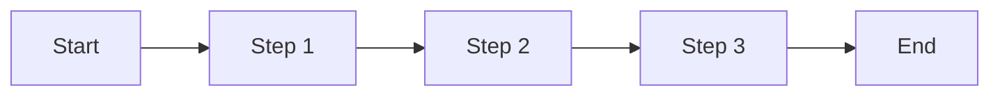
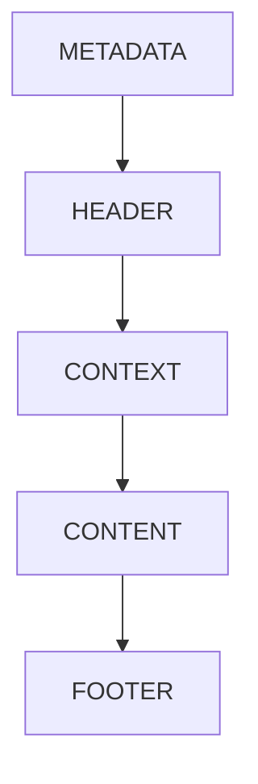
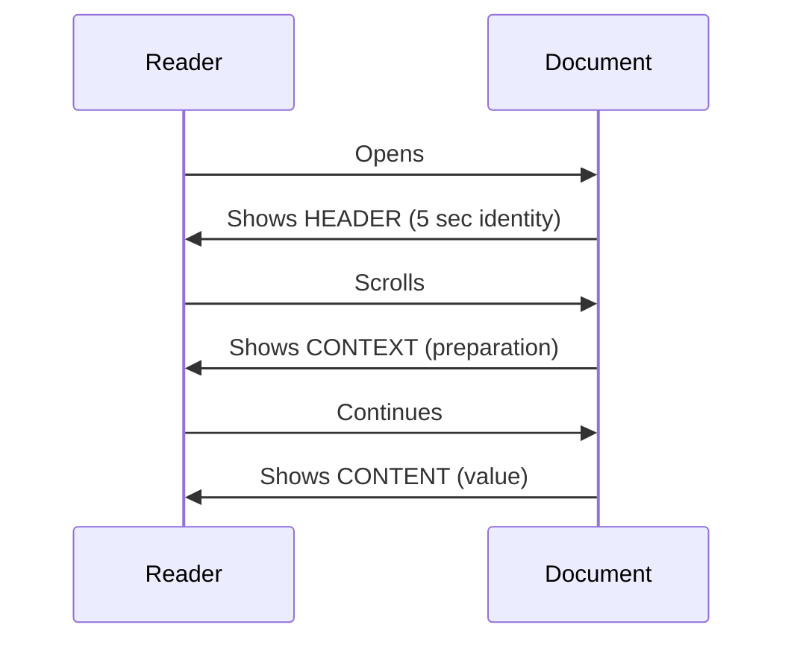

---
# ═══════════════════════════════════════════════════════════════════════════════
# METADATA BLOCK
# ═══════════════════════════════════════════════════════════════════════════════
#
# THINKING: This is YAML front matter - parseable by tools, minimally rendered.
# Serves systems (indexing, validation, cross-reference) AND establishes identity.
# This is the "catalog card" - what systems need to know about this document.
# YAML = "YAML Ain't Markup Language" - structured data format for metadata.
#
# Delete these comments when filling in, or keep for the next person.
#
# ═══════════════════════════════════════════════════════════════════════════════
#
# ─────────────────────────────────────────────────────────────────────────────
# IDENTITY - What IS this document
# ─────────────────────────────────────────────────────────────────────────────
key: B-word-seed-doc-markdown-base
                        # Bereshit keying: ORIGIN-FOLDER-DOMAIN-NAME
title:                  # Document title - clear, descriptive
type:                   # Document type: Standard | Guide | Template | Reference |
                        #                Index | Policy | Specification | Report
#
# ─────────────────────────────────────────────────────────────────────────────
# STATE - Where is this in its lifecycle
# ─────────────────────────────────────────────────────────────────────────────
status:                 # Lifecycle state: Draft | Active | Deprecated | Archived
version:                # SemVer (Semantic Versioning): X.Y.Z (major.minor.patch)
                        # Major = breaking changes, Minor = additions, Patch = fixes
#
# ─────────────────────────────────────────────────────────────────────────────
# TEMPORAL - When was this created and updated
# ─────────────────────────────────────────────────────────────────────────────
created:                # Creation date: YYYY-MM-DD (ISO 8601 format)
updated:                # Last update date: YYYY-MM-DD (ISO 8601 format)
#
# ─────────────────────────────────────────────────────────────────────────────
# ATTRIBUTION - Who created and maintains this
# ─────────────────────────────────────────────────────────────────────────────
authors: []             # List of authors: [Name1, Name2]
                        # Or with roles: [Name1 (Architect), Name2 (Implementation)]
#
# ─────────────────────────────────────────────────────────────────────────────
# LOCATION - Where does this live in the ternary structure
# ─────────────────────────────────────────────────────────────────────────────
path:                   # Ternary path: /org/word/ | /org/work/ | /org/fruit/
                        # Or full path: /org/word/standards/
#
# ─────────────────────────────────────────────────────────────────────────────
# CLASSIFICATION - How is this categorized for discovery
# ─────────────────────────────────────────────────────────────────────────────
tags: []                # Categorization tags: [template, documentation, standard]
                        # Enables: grep "tags:.*template" to find all templates
#
# ─────────────────────────────────────────────────────────────────────────────
# INTENT - Why does this document exist
# ─────────────────────────────────────────────────────────────────────────────
purpose:                # One-line purpose statement
                        # Pattern: "Enables X for Y" or "Defines X for Y"
#
# ─────────────────────────────────────────────────────────────────────────────
# DERIVATION - What template does this document implement
# ─────────────────────────────────────────────────────────────────────────────
derives_from: bereshit/word/omni/seed/B-word-omni-seed-documentation.omni
                        # Path to parent OmniCode template (establishes mapping)
#
# ─────────────────────────────────────────────────────────────────────────────
# GROUNDING - What biblical truth anchors this work
# ─────────────────────────────────────────────────────────────────────────────
biblical_foundation:    # Scripture reference (e.g., Genesis 1:1)
                        # The truth that grounds and informs this document
#
# ─────────────────────────────────────────────────────────────────────────────
# STRICTNESS - How strictly should this template be followed
# ─────────────────────────────────────────────────────────────────────────────
strictness:             # T (Tight) = Follow exactly, structure is required
                        # G (Guided) = Adapt thoughtfully, structure is recommended
                        # F (Free) = Principles only, structure is flexible
#
# ═══════════════════════════════════════════════════════════════════════════════
---
<!-- #!omni template --md -->

<!-- ═══════════════════════════════════════════════════════════════════════════════
     HEADER BLOCK - The Cover
     ═══════════════════════════════════════════════════════════════════════════════

     THINKING: What readers see FIRST. The "cover" of your document.
     In 5 seconds, readers should know: What is this? Is it current? Is it for me?

     Contains:
     - Title (H1): What IS this document
     - Tagline: What it enables/does (one line)
     - Badges: Visual status indicators (currency, state, type)
     - Grounding quote: Optional mission/purpose connection
     - Quick nav: Optional navigation bar for large documents

     This is RENDERED content - visible identity, not just metadata.

     ═══════════════════════════════════════════════════════════════════════════════ -->

<div align="center">

<!-- THINKING: Optional logo/image for branded documents

-->

# [Title]

<!-- THINKING: Clear, descriptive title. What IS this document?
     Should match the 'title' field in METADATA. -->

**[One-line tagline describing what this enables or does]**

<!-- THINKING: The value proposition. Why does this exist? What does reader get?
     Pattern: "The [thing] for [purpose]" or "[Verb]ing [outcome]" -->

<!-- THINKING: Badges provide instant visual status. Adjust colors:
     - Status: brightgreen (Active), yellow (Draft), red (Deprecated)
     - Version: blue (standard)
     - Type: purple, orange, or other distinguishing color
-->


<!-- THINKING: Optional additional badges


-->

<!-- THINKING: Optional grounding quote - connects to mission/purpose
     Use when the document has clear Kingdom significance -->
*[Optional: Mission statement or grounding quote connecting to biblical foundation]*

---

<!-- THINKING: Quick navigation bar - choose ONE style for your document:
     - Bullet separators (•) - clean, professional
     - kbd buttons - more visual, clickable appearance
     Link to major sections readers commonly need
-->

<kbd>[Overview](#overview)</kbd> <kbd>[Section 1](#section-1)</kbd> <kbd>[Toolkit](#markdown-toolkit)</kbd> <kbd>[References](#references)</kbd>

<!-- THINKING: Alternative bullet separator style - uncomment to use instead:
**[Overview](#overview)** • **[Section 1](#section-1)** • **[Markdown Toolkit](#markdown-toolkit)** • **[References](#references)**
-->

</div>

---

<!-- ═══════════════════════════════════════════════════════════════════════════════
     CONTEXT BLOCK - The Introduction
     ═══════════════════════════════════════════════════════════════════════════════

     THINKING: What readers need to understand BEFORE the main content.
     Prepares understanding - context before content.

     Contains:
     - Overview: Brief description of what this covers
     - Critical concept: > [!IMPORTANT] for must-know information
     - Quick Start: Optional fast path for doers
     - What This Provides: Table showing who gets what
     - Table of Contents: Navigation map for the document

     Layer for different readers:
     - Scan: Overview paragraph tells them what this is
     - Skim: Table shows what's here and who it serves
     - Read: They continue to Content block

     ═══════════════════════════════════════════════════════════════════════════════ -->

## Overview

<!-- THINKING: Brief description - what this document covers and why it matters.
     Keep it 2-4 sentences. Answer: What is this? Why should I care?
     Use <abbr> for first mention of technical terms (hover definitions). -->

[Brief description of what this document covers and why it matters to the reader]

This document follows the <abbr title="CreativeWorkzStudio LLC">CWS</abbr> 5-block documentation structure[^structure].

> [!IMPORTANT]
> **[<mark>Critical concept</mark> or distinction readers MUST understand before proceeding]**

<!-- THINKING: Use > [!IMPORTANT] for non-negotiable concepts.
     What misconception should we prevent? What's the key insight?
     Use <mark> sparingly for TRUE emphasis. Other callouts available:
     > [!NOTE], > [!TIP], > [!WARNING], > [!CAUTION] -->

> [!NOTE]
> **Scope:** [What IS and ISN'T covered by this document]

<!-- THINKING: Scope prevents wasted time. Be explicit about boundaries. -->

---

### Quick Start

<!-- THINKING: Optional section for doers who want to act immediately.
     Use numbered emoji comments for visual scanning.
     Skip this section if the document isn't action-oriented. -->

```bash
# 1️⃣ First step description
command-here arg1 arg2

# 2️⃣ Second step description
another-command --flag

# 3️⃣ Third step description
final-command
```

---

### What This Document Provides

<!-- THINKING: Table showing categories, what's included, and who it serves.
     Helps readers quickly assess if this document is for them.
     Center-align icon column with :----: -->

| | Category | What You'll Find | Who It Serves |
|:----:|----------|------------------|---------------|
| 📖 | **[Category Name]** | [Description of content] | [Target audience] |
| 🔧 | **[Category Name]** | [Description of content] | [Target audience] |
| 📐 | **[Category Name]** | [Description of content] | [Target audience] |

<!-- THINKING: Icon column uses emoji, but can also use Unicode symbols:
     ✓ ✗ for status, → for flow, • for bullets, 🟢 🟡 🔴 for status indicators -->

---

### Table of Contents

<!-- THINKING: Navigation map for the document (ToC = Table of Contents).
     Auto-generate with: doctoc filename.md --notitle
     Or maintain manually for control over what's included.
     Links use auto-generated anchors: #heading-text-lowercase-hyphenated -->

<!-- START doctoc generated TOC please keep comment here to allow auto update -->
<!-- DON'T EDIT THIS SECTION, INSTEAD RE-RUN doctoc TO UPDATE -->

- [\[Title\]](#title)
  - [Overview](#overview)
    - [Quick Start](#quick-start)
    - [What This Document Provides](#what-this-document-provides)
    - [Table of Contents](#table-of-contents)
  - [Section 1](#section-1)
    - [When to \[Do This Thing\]](#when-to-do-this-thing)
  - [Section 2](#section-2)
    - [Comparison or Decision Matrix](#comparison-or-decision-matrix)
    - [Process or Workflow](#process-or-workflow)
  - [Examples](#examples)
  - [Quick Reference](#quick-reference)
  - [Markdown Toolkit](#markdown-toolkit)
  - [Biblical Foundation](#biblical-foundation)
  - [References](#references)
    - [Related Documents](#related-documents)
    - [Standards \& Specifications](#standards--specifications)
    - [External Resources](#external-resources)
  - [See Also](#see-also)

<!-- END doctoc generated TOC please keep comment here to allow auto update -->

[↑ Back to Top](#title)

---

<!-- ═══════════════════════════════════════════════════════════════════════════════
     CONTENT BLOCK - The Chapters
     ═══════════════════════════════════════════════════════════════════════════════

     THINKING: The actual value - organized for reader comprehension.
     This is "the chapters" - the substance of the document.

     Structure elements:
     - H2 Sections: Major topics (navigable from ToC)
     - H3 Subsections: Detailed breakdowns
     - Tables: Comparisons, structured data
     - <details open>: Major content most readers need
     - <details>: Optional deep-dives (closed by default)
     - Code blocks: Examples with emoji comments (1️⃣ 2️⃣ 3️⃣)
     - Callouts: > [!TIP], > [!NOTE] for guidance
     - [Back to Top]: Navigation aids after major sections

     Toolkit elements to USE naturally:
     - <abbr title="hover text">TERM</abbr> for first technical term mentions
     - <mark>text</mark> sparingly for true emphasis
     - <kbd>key</kbd> for keyboard shortcuts or button-like navigation
     - Footnotes[^n] for depth without interrupting flow
     - Symbols: ✓ ✗ → ← • ▸ for visual scanning

     Layer for different readers:
     - Scan: Headings and tables give the shape
     - Read: Full explanations and examples
     - Study: <details> sections and footnotes for depth

     ═══════════════════════════════════════════════════════════════════════════════ -->

## Section 1

<!-- THINKING: Introduction to this section - what it covers and why it matters.
     Each H2 section should be navigable from Table of Contents.
     Use descriptive section names, not generic "Section 1" -->

[Introduction paragraph explaining what this section covers]

<details open>
<summary><h3>Subsection Title</h3></summary>

<!-- THINKING: Use <details open> for major content most people need.
     The content is visible by default but can be collapsed.
     Good for keeping document scannable while showing important content. -->

[Content organized clearly - explain the concept, pattern, or information]

**Key principle:** [The core idea readers should remember from this subsection]

### When to [Do This Thing]

<!-- THINKING: Decision guidance helps readers apply knowledge.
     Tables work well for scenario → approach → rationale patterns. -->

| Scenario | Approach | Rationale |
|----------|----------|-----------|
| **When [condition A]** | [What to do] | [Why this works] |
| **When [condition B]** | [What to do] | [Why this works] |
| **When [condition C]** | [What to do] | [Why this works] |

> [!TIP]
> **[Helpful non-obvious guidance or best practice]**

<!-- THINKING: > [!TIP] for recommendations and best practices.
     Use sparingly - if everything is a tip, nothing is. -->

[↑ Back to Top](#title)

</details>

<details>
<summary><h3>Optional Deep-Dive</h3></summary>

<!-- THINKING: Use <details> (closed by default) for optional depth.
     Advanced users can expand; others skip without scrolling past walls of text.
     Good for: edge cases, historical context, implementation details, theory. -->

[Detailed information for those who need deeper understanding]

**Technical details:**

```go
// Example code with comments explaining key aspects
func example() {
    // 1️⃣ First step explanation
    doSomething()

    // 2️⃣ Second step explanation
    doSomethingElse()
}
```

[↑ Back to Top](#title)

</details>

---

## Section 2

<!-- THINKING: Continue with additional sections as needed.
     Each major topic gets its own H2 section.
     Maintain consistent structure across sections. -->

[Introduction to this section]

### Comparison or Decision Matrix

<!-- THINKING: Tables excel at showing comparisons and relationships.
     Center-align status columns with :------:
     Use visual indicators: ✓ (yes), ✗ (no), ○ (optional), 🟢 🟡 🔴 (status) -->

| Feature | Option A | Option B | Recommended |
|---------|:--------:|:--------:|:-----------:|
| **[Feature 1]** | ✓ | ✗ | A |
| **[Feature 2]** | ✗ | ✓ | B |
| **[Feature 3]** | ✓ | ✓ | Either |
| **[Feature 4]** | ○ | ○ | Depends |

<!-- THINKING: ✓ = yes/has, ✗ = no/missing, ○ = optional/partial -->

### Process or Workflow

<!-- THINKING: For processes, numbered steps with clear outcomes.
     Can also use Mermaid diagrams for visual workflows. -->

1. **[Step Name]** — [What to do and expected outcome]
2. **[Step Name]** — [What to do and expected outcome]
3. **[Step Name]** — [What to do and expected outcome]

<!-- THINKING: Optional Mermaid diagram for visual learners -->



[↑ Back to Top](#title)

---

## Examples

<!-- THINKING: Real examples demonstrating concepts in practice.
     Link to actual files when possible - proof the pattern works.
     Show, don't just tell. -->

Real [documents/code/systems] demonstrating these [concepts/patterns] in practice.

<details open>
<summary><h3>Example 1: [Descriptive Name]</h3></summary>

**Source:** [Link to example file or location]

**What it demonstrates:**

| Aspect | How It's Shown |
|--------|----------------|
| **[Concept 1]** | [How the example demonstrates this] |
| **[Concept 2]** | [How the example demonstrates this] |

**Key insight:** [What readers should learn from studying this example]

[↑ Back to Top](#title)

</details>

<details>
<summary><h3>Example 2: [Descriptive Name]</h3></summary>

**Source:** [Link to example file or location]

[Description and analysis of this example]

[↑ Back to Top](#title)

</details>

---

## Quick Reference

<!-- THINKING: Checklists, summaries, or quick-lookup information.
     For returning users who know the content and need to verify/remember.
     Checkboxes render in GitHub: - [ ] unchecked, - [x] checked -->

<details open>
<summary><h3>Checklist: Before [Action]</h3></summary>

**Verify these before proceeding:**

- [ ] [Requirement or verification step]
- [ ] [Requirement or verification step]
- [ ] [Requirement or verification step]
- [ ] [Requirement or verification step]

</details>

<details open>
<summary><h3>Quick Lookup: [Topic]</h3></summary>

<!-- THINKING: Reference tables for common lookups.
     Keep it scannable - this is for quick answers, not learning. -->

| Term | Definition |
|------|------------|
| **[Term 1]** | [Brief definition] |
| **[Term 2]** | [Brief definition] |
| **[Term 3]** | [Brief definition] |

</details>

[↑ Back to Top](#title)

---

## Markdown Toolkit

<!-- THINKING: This section demonstrates ALL available Markdown/GitHub features.
     Use this as a reference when building documents - don't limit yourself!
     Delete this section in final documents, or keep relevant patterns. -->

<details open>
<summary><h3>Text Formatting</h3></summary>

| Format | Syntax | Result |
|--------|--------|--------|
| Bold | `**text**` | **text** |
| Italic | `*text*` | *text* |
| Bold+Italic | `***text***` | ***text*** |
| Strikethrough | `~~text~~` | ~~text~~ |
| Inline code | `` `code` `` | `code` |
| Highlight | `<mark>text</mark>` | <mark>text</mark> |
| Superscript | `<sup>text</sup>` | x<sup>2</sup> |
| Subscript | `<sub>text</sub>` | H<sub>2</sub>O |
| Keyboard | `<kbd>key</kbd>` | <kbd>Ctrl</kbd>+<kbd>C</kbd> |

</details>

<details open>
<summary><h3>Abbreviations & Definitions</h3></summary>

<!-- THINKING: <abbr> provides hover definitions - great for acronyms/jargon -->

Use abbreviations for technical terms: <abbr title="Covenant Partnership Intelligence - Structured Intelligence">CPI-SI</abbr> is our paradigm. <abbr title="CreativeWorkzStudio LLC">CWS</abbr> is the company. <abbr title="YAML Ain't Markup Language">YAML</abbr> front matter provides metadata.

**Syntax:**

```html
<abbr title="Full explanation on hover">ABBR</abbr>
```

</details>

<details open>
<summary><h3>Footnotes</h3></summary>

<!-- THINKING: Footnotes keep flow clean while providing depth for those who want it -->

This document follows the 5-block structure[^1]. The structure ensures PhD rigor[^2] with Bible accessibility.

**Syntax:**

```markdown
Text with footnote[^1].

[^1]: Footnote content appears at document bottom.
```

[^1]: See CWS-STD-006 for complete 5-block documentation.
[^2]: Rigor meaning: complete, defensible, thorough structure.

</details>

<details open>
<summary><h3>Navigation Styles</h3></summary>

<!-- THINKING: Multiple ways to create navigation - choose based on document style -->

**Bullet separators:**
**[Section 1](#section-1)** • **[Section 2](#section-2)** • **[References](#references)**

**Pipe separators:**
[Section 1](#section-1) | [Section 2](#section-2) | [References](#references)

**Button style (kbd):**
<kbd>[Section 1](#section-1)</kbd> <kbd>[Section 2](#section-2)</kbd> <kbd>[References](#references)</kbd>

**Arrow style:**
[Section 1](#section-1) → [Section 2](#section-2) → [References](#references)

</details>

<details open>
<summary><h3>Callout Types (GitHub Alerts)</h3></summary>

> [!NOTE]
> **Note:** Additional context, supplementary information, scope clarification.
---

> [!TIP]
> **Tip:** Best practices, recommendations, helpful guidance.
---

> [!IMPORTANT]
> **Important:** Critical concepts, must-understand information, non-negotiable.

---

> [!WARNING]
> **Warning:** Potential issues, cautions, things to avoid.

---

> [!CAUTION]
> **Caution:** Serious warnings, actions that could cause problems.

</details>

<details open>
<summary><h3>Unicode Symbols Reference</h3></summary>

| Category | Symbols | Use For |
|----------|---------|---------|
| **Checks** | ✓ ✗ ✔ ✘ ☑ ☐ | Status, completion |
| **Arrows** | → ← ↑ ↓ ↔ ⇒ ⟶ | Flow, navigation |
| **Bullets** | • ◦ ▪ ▸ ► ‣ | Lists, separators |
| **Math** | × ÷ ± ≠ ≤ ≥ ∞ ≈ | Calculations |
| **Status** | 🟢 🟡 🔴 ⚪ | Visual indicators |
| **Misc** | © ® ™ ° … § † ‡ | Legal, typography |
| **Box drawing** | ┌ ─ ┐ │ └ ┘ ├ ┤ | ASCII diagrams |

</details>

<details>
<summary><h3>Advanced: Mermaid Diagrams</h3></summary>

<!-- THINKING: Mermaid renders in GitHub - great for flowcharts, sequences, architecture -->

**Flowchart:**



**Sequence diagram:**



**Other types:** `graph`, `pie`, `gantt`, `classDiagram`, `stateDiagram`, `erDiagram`

</details>

<details>
<summary><h3>Advanced: Table Alignment</h3></summary>

| Left (default) | Center | Right |
|----------------|:------:|------:|
| Text | Text | Text |
| Longer text | Centered | 123 |

**Syntax:**

```markdown
| Left | Center | Right |
|------|:------:|------:|
```

- `:----:` = center
- `-----:` = right
- `------` = left (default)

</details>

<details>
<summary><h3>Advanced: Reference-Style Links</h3></summary>

<!-- THINKING: Reference links keep document clean, URLs managed in one place -->

Instead of inline links everywhere, use references:

```markdown
See the [documentation standard][std-006] for details.
The [base template][g-000] implements this structure.

<!-- At bottom of document -->
[std-006]: path/to/CWS-STD-006.md "5-Block Documentation"
[g-000]: path/to/TEMPLATE-G-000.md "Base Template"
```

**Benefits:**

- URLs defined once, used many times
- Easy to update if paths change
- Cleaner reading experience in raw Markdown

</details>

[↑ Back to Top](#title)

---

<!-- ═══════════════════════════════════════════════════════════════════════════════
     FOOTER BLOCK - The Appendix
     ═══════════════════════════════════════════════════════════════════════════════

     THINKING: Where readers go NEXT. Resources, references, connections.
     This is the "appendix" - supporting material and navigation.

     Contains:
     - Biblical Foundation: Grounding in truth (the WHY beneath the what)
     - References: Links to related documents, standards, resources
     - Centered closing: Key summary, version, grounding verse
     - Cross-references: Connection to the larger ecosystem

     Send readers out with:
     - Grounding in truth (why this matters eternally)
     - Clear next steps (where to go from here)
     - Connection to ecosystem (how this fits the whole)

     ═══════════════════════════════════════════════════════════════════════════════ -->

## Biblical Foundation

<!-- THINKING: Connect the work to eternal truth.
     Not decoration - genuine grounding that informs the document.
     If you can't articulate how Scripture informs this work, reflect on whether
     the document serves Kingdom purposes. -->

[^structure]: The 5-block structure: <abbr title="YAML front matter">METADATA</abbr> → HEADER → CONTEXT → CONTENT → FOOTER. See <abbr title="Standard document key">CWS-STD-006</abbr> for full specification.

> [!NOTE]
> **[Context for why this biblical principle applies to this document's topic]**

*"[Scripture verse that grounds this work]"* — **[Book Chapter:Verse]**

**Applied:** [How this scriptural truth specifically informs this document's approach, structure, or content. Make the connection clear and practical.]

[↑ Back to Top](#title)

---

## References

<!-- THINKING: Organize references by type for easy discovery.
     Use reference-style links at bottom for maintainability.
     Link generously - knowledge grows through connection. -->

### Related Documents

<!-- THINKING: Documents readers should explore next or alongside this one.
     Use reference-style links [text][ref] for maintainability. -->

| | Document | Purpose |
|:----:|----------|---------|
| 📐 | **[Document Title][ref-doc1]** | [What it covers and why it's related] |
| 📖 | **[Document Title][ref-doc2]** | [What it covers and why it's related] |

<!-- Reference links defined at bottom of document -->

### Standards & Specifications

<!-- THINKING: Standards this document implements or relates to. -->

| Standard | Purpose |
|----------|---------|
| **[CWS-STD-###][std-ref]** | [What it governs] |
| **[CWS-STD-###][std-ref2]** | [What it governs] |

### External Resources

<!-- THINKING: External links for further learning. -->

| Resource | Purpose |
|----------|---------|
| **[Resource Name][ext-ref]** | [What it provides] |

---

## See Also

<!-- THINKING: Cross-references to related ecosystem documents.
     Helps readers discover connected knowledge. -->

- **[Related Document 1]** — [Brief description of relationship]
- **[Related Document 2]** — [Brief description of relationship]
- **[Related Document 3]** — [Brief description of relationship]

---

<div align="center">

<!-- THINKING: Centered footer provides closure and key information at a glance.
     Summarizes identity, provides navigation, grounds in truth. -->

**[↑ Back to Top](#title)**

---

**Key:** [DOMAIN-CAT-###] • **Type:** [Type] • **Version:** [X.Y.Z]

**Status:** [Active|Draft|Deprecated] • **Updated:** [YYYY-MM-DD]

---

*"[Biblical foundation verse from METADATA]"* — **[Reference]**

**[One line connecting this work to Kingdom purpose]**

---

<!-- THINKING: Optional company standards navigation
**Company Standards:**
[4-Block Structure](link) • [Document Keying](link) • [Documentation Standards](link)
-->

</div>

<!-- ═══════════════════════════════════════════════════════════════════════════════
     REFERENCE-STYLE LINKS
     ═══════════════════════════════════════════════════════════════════════════════

     THINKING: Define all links here for maintainability.
     If a URL changes, update once here instead of throughout document.
     Format: [ref-name]: url "optional title"

     ═══════════════════════════════════════════════════════════════════════════════ -->

<!-- Document references -->
[ref-doc1]: ../path/to/document.md "Related Document 1"
[ref-doc2]: ../path/to/document.md "Related Document 2"

<!-- Standard references -->
[std-ref]: ../standards/CWS-STD-001-DOC-4-block.md "4-Block Structure Standard"
[std-ref2]: ../standards/CWS-STD-002-DOC-document-keying.md "Document Keying Standard"

<!-- External references -->
[ext-ref]: https://example.com "External Resource"

<!-- ═══════════════════════════════════════════════════════════════════════════════
     TEMPLATE NOTES - DELETE WHEN USING
     ═══════════════════════════════════════════════════════════════════════════════

     This template embodies:
     - PhD dissertation RIGOR: Complete structure, clear citations, defensible
     - Bible ACCESSIBILITY: Layered for all readers, clear navigation, timeless

     The 5-Block Pattern:
     ┌─────────────────────────────────────────────────────────────────┐
     │ METADATA   │ The catalog card - parseable identity for systems │
     ├─────────────────────────────────────────────────────────────────┤
     │ HEADER     │ The cover - visible identity in 5 seconds         │
     ├─────────────────────────────────────────────────────────────────┤
     │ CONTEXT    │ The introduction - prepares understanding         │
     ├─────────────────────────────────────────────────────────────────┤
     │ CONTENT    │ The chapters - value organized for discovery      │
     ├─────────────────────────────────────────────────────────────────┤
     │ FOOTER     │ The appendix - resources and grounding            │
     └─────────────────────────────────────────────────────────────────┘

     Layered Reading:
     - SCAN (5 sec):    Title, badges, tagline → what is this?
     - SKIM (1 min):    Overview, tables, headings → what's the shape?
     - READ (full):     All content → understand and apply
     - STUDY (deep):    Details sections, footnotes → master it
     - REFERENCE:       Quick Reference, anchors → find what I need

     ─────────────────────────────────────────────────────────────────
     TOOLKIT ELEMENTS - USE THESE NATURALLY THROUGHOUT YOUR DOCUMENT
     ─────────────────────────────────────────────────────────────────

     First technical term mentions → <abbr title="Full explanation">ABBR</abbr>
     True emphasis (rare)          → <mark>highlighted text</mark>
     Navigation/buttons            → <kbd>[Link](#anchor)</kbd>
     Depth without interruption    → Footnotes[^n] with [^n]: definition at bottom
     Status/comparison in tables   → ✓ (yes) ✗ (no) ○ (optional)
     Flow and sequence             → A → B → C
     Collapsible content           → <details open> for major, <details> for optional

     Callouts for guidance:
     > [!NOTE]      - additional context, scope
     > [!TIP]       - recommendations, best practices
     > [!IMPORTANT] - critical concepts, must-know
     > [!WARNING]   - potential issues, cautions
     > [!CAUTION]   - serious warnings

     Diagrams when helpful:
     ```mermaid
     flowchart TD
         A[Start] -> B[Process] -> C[End]
     ```
     
     Reference-style links (define at bottom, use throughout):
     [descriptive text][ref-name]  →  [ref-name]: url "hover title"

     ─────────────────────────────────────────────────────────────────

     When filling this template:
     1. Start with METADATA → establish identity
     2. Write HEADER → the hook that draws readers in
     3. Draft CONTEXT → prepare their understanding
     4. Build CONTENT → deliver the value (USE toolkit elements naturally!)
     5. Complete FOOTER → ground and connect
     6. Delete THINKING comments (or keep for next person)
     7. Delete/modify Markdown Toolkit section (keep as reference or remove)
     8. Update reference-style links at bottom
     9. Run doctoc to generate/update Table of Contents

     KEY PRINCIPLE: Don't just demonstrate toolkit elements in a separate section -
     USE them throughout. <abbr> on first technical terms. <mark> for true emphasis.
     <kbd> for navigation. Footnotes for depth. Symbols for scanning. The toolkit
     section shows WHAT'S AVAILABLE; your document shows HOW TO USE THEM.

     ═══════════════════════════════════════════════════════════════════════════════ -->
