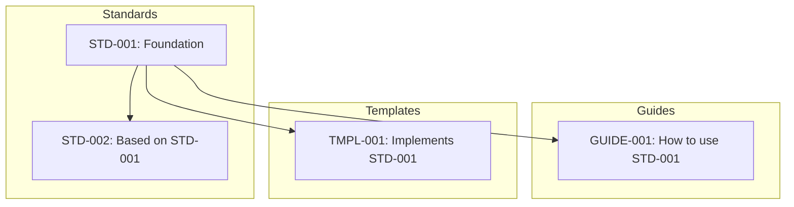
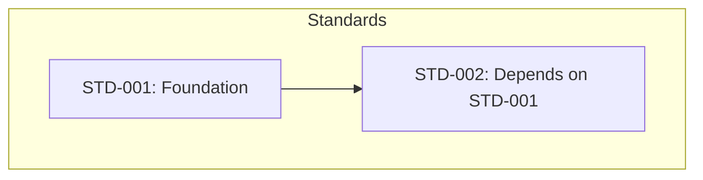

---
# ═══════════════════════════════════════════════════════════════════════════════
# METADATA BLOCK
# ═══════════════════════════════════════════════════════════════════════════════
#
# THINKING: This is YAML front matter - parseable by tools, minimally rendered.
# For INDEX documents: Establishes what this index organizes and its scope.
# INDEX documents are navigation hubs - they help readers FIND other documents.
# YAML = "YAML Ain't Markup Language" - structured data format for metadata.
#
# INDEX documents typically have type: Index and purpose focused on organization.
# Delete these comments when filling in, or keep for the next person.
#
# ═══════════════════════════════════════════════════════════════════════════════
#
# ─────────────────────────────────────────────────────────────────────────────
# IDENTITY - What IS this document
# ─────────────────────────────────────────────────────────────────────────────
key: B-word-seed-doc-markdown-index
                        # Bereshit keying: ORIGIN-FOLDER-DOMAIN-NAME
title:                  # Document title - clear, descriptive
type:                   # Document type: Index (for this template)
                        # Other types: Standard | Guide | Template | Reference |
                        #              Policy | Specification | Report
#
# ─────────────────────────────────────────────────────────────────────────────
# STATE - Where is this in its lifecycle
# ─────────────────────────────────────────────────────────────────────────────
status:                 # Lifecycle state: Draft | Active | Deprecated | Archived
version:                # SemVer (Semantic Versioning): X.Y.Z (major.minor.patch)
                        # Major = breaking changes, Minor = additions, Patch = fixes
#
# ─────────────────────────────────────────────────────────────────────────────
# TEMPORAL - When was this created and updated
# ─────────────────────────────────────────────────────────────────────────────
created:                # Creation date: YYYY-MM-DD (ISO 8601 format)
updated:                # Last update date: YYYY-MM-DD (ISO 8601 format)
#
# ─────────────────────────────────────────────────────────────────────────────
# ATTRIBUTION - Who created and maintains this
# ─────────────────────────────────────────────────────────────────────────────
authors: []             # List of authors: [Name1, Name2]
                        # Or with roles: [Name1 (Architect), Name2 (Implementation)]
#
# ─────────────────────────────────────────────────────────────────────────────
# LOCATION - Where does this live in the ternary structure
# ─────────────────────────────────────────────────────────────────────────────
path:                   # Ternary path: /org/word/ | /org/work/ | /org/fruit/
                        # Or full path: /org/word/standards/
#
# ─────────────────────────────────────────────────────────────────────────────
# CLASSIFICATION - How is this categorized for discovery
# ─────────────────────────────────────────────────────────────────────────────
tags: []                # Categorization tags: [template, documentation, standard]
                        # Enables: grep "tags:.*template" to find all templates
#
# ─────────────────────────────────────────────────────────────────────────────
# INTENT - Why does this document exist
# ─────────────────────────────────────────────────────────────────────────────
purpose:                # One-line purpose statement - for INDEX: what does this organize?
                        # Pattern: "Organizes X for discovery" or "Navigation hub for Y"
#
# ─────────────────────────────────────────────────────────────────────────────
# DERIVATION - What template does this document implement
# ─────────────────────────────────────────────────────────────────────────────
derives_from: bereshit/word/seed/documentation/B-word-seed-doc-markdown-base.md
                        # Path to parent template (variant of markdown-base)
#
# ─────────────────────────────────────────────────────────────────────────────
# GROUNDING - What biblical truth anchors this work
# ─────────────────────────────────────────────────────────────────────────────
biblical_foundation:    # Scripture reference (e.g., Genesis 1:1)
                        # The truth that grounds and informs this document
#
# ─────────────────────────────────────────────────────────────────────────────
# STRICTNESS - How strictly should this template be followed
# ─────────────────────────────────────────────────────────────────────────────
strictness:             # T (Tight) = Follow exactly, structure is required
                        # G (Guided) = Adapt thoughtfully, structure is recommended
                        # F (Free) = Principles only, structure is flexible
#
# ═══════════════════════════════════════════════════════════════════════════════
---
<!-- #!omni template --md -->

<!-- ═══════════════════════════════════════════════════════════════════════════════
     HEADER BLOCK - The Cover
     ═══════════════════════════════════════════════════════════════════════════════

     THINKING: What readers see FIRST. The "cover" of your INDEX document.
     In 5 seconds, readers should know: What does this index? Where can I go from here?

     For INDEX documents:
     - Title (H1): What this index organizes (e.g., "Standards Index", "Project Documentation")
     - Tagline: What readers can find here (e.g., "Navigate all project standards")
     - Badges: Visual status indicators (currency, state, type=Index)
     - Quick nav: ESSENTIAL for INDEX - links to major categories

     INDEX HEADER focuses on: "What can I find here?" not "What will I learn?"

     ═══════════════════════════════════════════════════════════════════════════════ -->

<div align="center">

<!-- THINKING: Optional logo/image for branded documents

-->

# [Index Title]

<!-- THINKING: Clear title showing what this INDEX organizes.
     Examples: "Standards Index", "API Documentation", "Project Navigation"
     Should match the 'title' field in METADATA. -->

**[One-line tagline: what readers can find and navigate from here]**

<!-- THINKING: For INDEX: What can readers discover here? Where can they go?
     Pattern: "Navigate [domain]" or "Find [resources] organized by [category]" -->

<!-- THINKING: Badges provide instant visual status. Adjust colors:
     - Status: brightgreen (Active), yellow (Draft), red (Deprecated)
     - Version: blue (standard)
     - Type: purple, orange, or other distinguishing color
-->


<!-- THINKING: Optional additional badges


-->

<!-- THINKING: Optional grounding quote - connects to mission/purpose
     Use when the document has clear Kingdom significance -->
*[Optional: Mission statement or grounding quote connecting to biblical foundation]*

---

<!-- THINKING: Quick navigation bar - ESSENTIAL for INDEX documents.
     For INDEX: Link to major CATEGORIES readers want to browse.
     - kbd buttons work well for category navigation
     - Categories might be: By Type, By Domain, By Status, Recent, etc.
-->

<kbd>[Overview](#overview)</kbd> <kbd>[By Category](#by-category)</kbd> <kbd>[By Type](#by-type)</kbd> <kbd>[Recent](#recent-documents)</kbd> <kbd>[References](#references)</kbd>

<!-- THINKING: Alternative bullet separator style - uncomment to use instead:
**[Overview](#overview)** • **[Section 1](#section-1)** • **[Markdown Toolkit](#markdown-toolkit)** • **[References](#references)**
-->

</div>

---

<!-- ═══════════════════════════════════════════════════════════════════════════════
     CONTEXT BLOCK - The Introduction
     ═══════════════════════════════════════════════════════════════════════════════

     THINKING: What readers need to understand BEFORE navigating.
     For INDEX: Prepares readers to FIND things, not learn concepts.

     For INDEX documents:
     - Overview: What this index organizes and how it's structured
     - Critical concept: How to use this index effectively
     - Quick Start: "Looking for X? Go here" - fast paths to common needs
     - What This Provides: Categories of documents available
     - Table of Contents: The navigation map itself

     Layer for INDEX readers:
     - Scan: Overview tells them what's indexed here
     - Skim: Categories show how documents are organized
     - Navigate: They go directly to what they need

     ═══════════════════════════════════════════════════════════════════════════════ -->

## Overview

<!-- THINKING: For INDEX: What is indexed here and how is it organized?
     Keep it 2-4 sentences. Answer: What can I find? How is it structured?
     Use <abbr> for first mention of technical terms (hover definitions). -->

[Brief description of what this INDEX organizes - what documents, what domain, how structured]

This index follows the <abbr title="CreativeWorkzStudio LLC">CWS</abbr> 5-block documentation structure[^structure].

> [!IMPORTANT]
> **[<mark>How to use this index</mark> - organization principle or key navigation tip]**

<!-- THINKING: For INDEX: Help readers understand the organization principle.
     What's the categorization logic? How should they navigate?
     Use <mark> sparingly for TRUE emphasis. -->

> [!NOTE]
> **Scope:** [What IS and ISN'T indexed here - boundaries of this navigation hub]

<!-- THINKING: Scope prevents wasted time. What domains are covered? What's elsewhere? -->

---

### Quick Start

<!-- THINKING: For INDEX: Fast paths to common needs.
     "Looking for X? Go here" style navigation shortcuts.
     Essential for INDEX - helps readers jump to what they need. -->

**Looking for something specific?**

| If You Need... | Go To |
|----------------|-------|
| 🔍 **[Common need 1]** | [Link to relevant section](#section) |
| 📐 **[Common need 2]** | [Link to relevant section](#section) |
| 📖 **[Common need 3]** | [Link to relevant section](#section) |
| 🔧 **[Common need 4]** | [Link to relevant section](#section) |

---

### What This Index Contains

<!-- THINKING: For INDEX: Show the categories of documents available.
     Helps readers understand what's organized here and how to find it.
     Center-align icon column with :----: -->

| | Category | Documents | Count |
|:----:|----------|-----------|:-----:|
| 📐 | **[Category Name]** | [Types of documents in this category] | [#] |
| 📖 | **[Category Name]** | [Types of documents in this category] | [#] |
| 🔧 | **[Category Name]** | [Types of documents in this category] | [#] |

<!-- THINKING: For INDEX: Show document counts to help readers gauge scope.
     Categories should match how documents are organized in CONTENT block. -->

---

### Table of Contents

<!-- THINKING: For INDEX: The ToC IS the navigation map.
     This is the core of what an INDEX provides.
     Auto-generate with: doctoc filename.md --notitle
     Links use auto-generated anchors: #heading-text-lowercase-hyphenated -->

<!-- START doctoc generated TOC please keep comment here to allow auto update -->
<!-- DON'T EDIT THIS SECTION, INSTEAD RE-RUN doctoc TO UPDATE -->

- [\[Index Title\]](#index-title)
  - [Overview](#overview)
    - [Quick Start](#quick-start)
    - [What This Index Contains](#what-this-index-contains)
    - [Table of Contents](#table-of-contents)
  - [By Category](#by-category)
  - [By Type](#by-type)
    - [Standards](#standards)
    - [Guides](#guides)
    - [Templates](#templates)
  - [Recent Documents](#recent-documents)
  - [Document Map](#document-map)
  - [Quick Reference](#quick-reference)
  - [Toolkit for INDEX Documents](#toolkit-for-index-documents)
  - [Biblical Foundation](#biblical-foundation)
  - [References](#references)
    - [Related Indexes](#related-indexes)
    - [Standards \& Specifications](#standards--specifications)
    - [External Resources](#external-resources)
  - [See Also](#see-also)

<!-- END doctoc generated TOC please keep comment here to allow auto update -->

[↑ Back to Top](#index-title)

---

<!-- ═══════════════════════════════════════════════════════════════════════════════
     CONTENT BLOCK - The Navigation Tables
     ═══════════════════════════════════════════════════════════════════════════════

     THINKING: For INDEX: The actual navigation - organized for FINDING.
     This is "the directory" - tables of links to documents.

     For INDEX documents:
     - H2 Sections: Major categories (By Type, By Domain, Recent, etc.)
     - H3 Subsections: Subcategories within each organization scheme
     - Tables: Document listings with Key, Title, Purpose, Status
     - <details open>: Primary categories most readers browse
     - <details>: Secondary categories or archived documents
     - [Back to Top]: Navigation aids after each category

     INDEX-specific elements:
     - Tables of links (primary content type)
     - Status indicators: 🟢 Active, 🟡 Draft, 🔴 Deprecated
     - Document counts per category
     - Brief descriptions (1-line purpose, not full explanations)

     Layer for INDEX readers:
     - Scan: Category headings show organization
     - Browse: Tables show documents available
     - Navigate: Click through to destination documents

     ═══════════════════════════════════════════════════════════════════════════════ -->

## By Category

<!-- THINKING: For INDEX: Primary organization scheme - by document category/domain.
     Each H2 section is a different way to browse the indexed documents.
     Use descriptive section names that match how readers think about finding things. -->

Documents organized by their primary category or domain.

<details open>
<summary><h3>Category 1</h3></summary>

<!-- THINKING: For INDEX: Use <details open> for primary categories.
     Tables are the primary content - listing documents with key info.
     Keep descriptions brief - readers click through to learn more. -->

[Brief description of what this category contains]

| Status | Key | Document | Purpose |
|:------:|-----|----------|---------|
| 🟢 | **[KEY-001][key-001]** | [Document Title] | [One-line purpose] |
| 🟢 | **[KEY-002][key-002]** | [Document Title] | [One-line purpose] |
| 🟡 | **[KEY-003][key-003]** | [Document Title] | [One-line purpose] |

<!-- THINKING: Status indicators: 🟢 Active, 🟡 Draft, 🔴 Deprecated, ⚪ Archived
     Keys link to documents using reference-style links defined at bottom. -->

> [!TIP]
> **[Navigation tip for this category - what to look at first, relationships]**

[↑ Back to Top](#index-title)

</details>

<details open>
<summary><h3>Category 2</h3></summary>

<!-- THINKING: For INDEX: Repeat pattern for each category.
     Consistent structure helps readers know what to expect. -->

[Brief description of what this category contains]

| Status | Key | Document | Purpose |
|:------:|-----|----------|---------|
| 🟢 | **[KEY-004][key-004]** | [Document Title] | [One-line purpose] |
| 🟢 | **[KEY-005][key-005]** | [Document Title] | [One-line purpose] |

[↑ Back to Top](#index-title)

</details>

<details>
<summary><h3>Archived Documents</h3></summary>

<!-- THINKING: For INDEX: Use <details> (closed) for archived/deprecated documents.
     Still accessible but not prominent. -->

Documents that have been superseded or archived.

| Status | Key | Document | Superseded By |
|:------:|-----|----------|---------------|
| ⚪ | **[KEY-OLD][key-old]** | [Old Document] | [KEY-NEW][key-new] |

[↑ Back to Top](#index-title)

</details>

---

## By Type

<!-- THINKING: For INDEX: Alternative organization - by document type.
     Same documents, different way to find them.
     Useful when readers know WHAT type they need but not which category. -->

Documents organized by their type (Standard, Guide, Template, etc.).

### Standards

<!-- THINKING: For INDEX: Group by document type.
     Types from CWS keying: Standard, Guide, Template, Reference, Index, Policy, Specification -->

| Status | Key | Document | Category |
|:------:|-----|----------|----------|
| 🟢 | **[STD-001][std-001]** | [Standard Name] | [Category] |
| 🟢 | **[STD-002][std-002]** | [Standard Name] | [Category] |

### Guides

| Status | Key | Document | Category |
|:------:|-----|----------|----------|
| 🟢 | **[GUIDE-001][guide-001]** | [Guide Name] | [Category] |

### Templates

| Status | Key | Document | Category |
|:------:|-----|----------|----------|
| 🟢 | **[TMPL-001][tmpl-001]** | [Template Name] | [Category] |

[↑ Back to Top](#index-title)

---

## Recent Documents

<!-- THINKING: For INDEX: Show recently added or updated documents.
     Helps readers stay current with changes. -->

Documents added or significantly updated recently.

| Date | Status | Key | Document | Change |
|------|:------:|-----|----------|--------|
| YYYY-MM-DD | 🟢 | **[KEY-001][key-001]** | [Document Title] | Added |
| YYYY-MM-DD | 🟢 | **[KEY-002][key-002]** | [Document Title] | Updated |

[↑ Back to Top](#index-title)

---

## Document Map

<!-- THINKING: For INDEX: Visual representation of document relationships.
     Helps readers understand how documents connect.
     Use Mermaid diagrams for visual learners. -->

How the indexed documents relate to each other.

<details open>
<summary><h3>Relationship Diagram</h3></summary>

<!-- THINKING: For INDEX: Show document dependencies and relationships.
     Mermaid flowcharts work well for showing document hierarchies. -->



**Key relationships:**

| Document | Depends On | Used By |
|----------|------------|---------|
| **[STD-001]** | (Foundation) | STD-002, GUIDE-001, TMPL-001 |
| **[STD-002]** | STD-001 | — |

[↑ Back to Top](#index-title)

</details>

<details>
<summary><h3>Reading Order</h3></summary>

<!-- THINKING: For INDEX: Suggest order for readers new to the domain.
     Helps readers know where to start. -->

**If you're new to [this domain], read in this order:**

1. **[STD-001][std-001]** — Foundation concepts
2. **[GUIDE-001][guide-001]** — How to apply the foundation
3. **[TMPL-001][tmpl-001]** — Templates to get started

[↑ Back to Top](#index-title)

</details>

---

## Quick Reference

<!-- THINKING: For INDEX: Fast lookup tables for document discovery.
     Organized for returning users who know what they need and want to find it fast.
     Focus on: key lookup, status overview, document counts. -->

<details open>
<summary><h3>Document Key Lookup</h3></summary>

<!-- THINKING: For INDEX: Allow readers to jump directly by key.
     Alphabetical or logical ordering for fast scanning. -->

**Jump to document by key:**

| Key | Document | Status |
|-----|----------|:------:|
| **[KEY-001][key-001]** | [Document Title] | 🟢 |
| **[KEY-002][key-002]** | [Document Title] | 🟢 |
| **[KEY-003][key-003]** | [Document Title] | 🟡 |

</details>

<details open>
<summary><h3>Status Overview</h3></summary>

<!-- THINKING: For INDEX: Aggregate status for quick health check of indexed documents. -->

| Status | Count | Documents |
|:------:|:-----:|-----------|
| 🟢 Active | [#] | [List or "See By Category"] |
| 🟡 Draft | [#] | [List or "See By Category"] |
| 🔴 Deprecated | [#] | [List or "See Archived"] |
| ⚪ Archived | [#] | [List or "See Archived"] |

**Total indexed documents:** [#]

</details>

<details>
<summary><h3>Document Type Legend</h3></summary>

<!-- THINKING: For INDEX: Help readers understand document types indexed here. -->

| Type | Description | Example |
|------|-------------|---------|
| **Standard** | Defines requirements and patterns | STD-001 |
| **Guide** | Explains how to apply standards | GUIDE-001 |
| **Template** | Starting point for new documents | TMPL-001 |
| **Reference** | Lookup information | REF-001 |
| **Index** | Navigation hub (like this document) | INDEX-001 |

</details>

[↑ Back to Top](#index-title)

---

## Toolkit for INDEX Documents

<!-- THINKING: For INDEX: Which Markdown elements are MOST useful for navigation documents?
     This section shows the toolkit tailored for INDEX document needs.
     Delete this section in final documents, or keep relevant patterns for reference. -->

<details open>
<summary><h3>Essential: Navigation Links</h3></summary>

<!-- THINKING: For INDEX: Navigation is your PRIMARY purpose. Master these. -->

**Button style (kbd) - recommended for INDEX navigation:**
<kbd>[Category 1](#category-1)</kbd> <kbd>[Category 2](#category-2)</kbd> <kbd>[Recent](#recent)</kbd>

**Bullet separators - works well in HEADER:**
**[By Category](#by-category)** • **[By Type](#by-type)** • **[References](#references)**

**Arrow style - shows reading order:**
[Foundation](#foundation) → [Guides](#guides) → [Templates](#templates)

**Back to Top (essential for long INDEX documents):**
`[↑ Back to Top](#index-title)`

</details>

<details open>
<summary><h3>Essential: Tables for Document Listings</h3></summary>

<!-- THINKING: For INDEX: Tables are your PRIMARY content type. -->

**Standard document listing:**

| Status | Key | Document | Purpose |
|:------:|-----|----------|---------|
| 🟢 | **[KEY-001][key-001]** | [Title] | [One-line purpose] |

**Center-align status column:** `:------:`

**Reference-style links for maintainability:**

```markdown
| **[KEY-001][key-001]** | Title |

[key-001]: path/to/doc.md "Hover title"
```

</details>

<details open>
<summary><h3>Essential: Status Indicators</h3></summary>

<!-- THINKING: For INDEX: Visual status is critical for navigation. -->

| Symbol | Meaning | Use When |
|:------:|---------|----------|
| 🟢 | Active | Document is current and maintained |
| 🟡 | Draft | Document is in development |
| 🔴 | Deprecated | Document is being phased out |
| ⚪ | Archived | Document is historical reference only |

**In badges:**
``

</details>

<details open>
<summary><h3>Collapsible Sections</h3></summary>

<!-- THINKING: For INDEX: Manage information density with collapsibles. -->

**Primary categories (open by default):**

```html
<details open>
<summary><h3>Category Name</h3></summary>
Content here
</details>
```

**Secondary/archived (closed by default):**

```html
<details>
<summary><h3>Archived Documents</h3></summary>
Content here
</details>
```

</details>

<details>
<summary><h3>Document Relationship Diagrams</h3></summary>

<!-- THINKING: For INDEX: Visual maps help readers understand document relationships. -->

**Mermaid flowchart for document dependencies:**



**When to use:** Document Map section, showing how indexed documents relate.

</details>

<details>
<summary><h3>Full Toolkit Reference</h3></summary>

<!-- THINKING: Complete reference for when you need something beyond navigation basics. -->

**Text formatting:**
| `**bold**` | `*italic*` | `` `code` `` | `<mark>highlight</mark>` | `<kbd>key</kbd>` |

**Abbreviations:** `<abbr title="Full text on hover">ABBR</abbr>`

**Callouts:** `> [!NOTE]`, `> [!TIP]`, `> [!IMPORTANT]`, `> [!WARNING]`

**Footnotes:** `Text[^1]` with `[^1]: Definition at bottom`

**Unicode symbols:**

- Status: ✓ ✗ 🟢 🟡 🔴 ⚪
- Navigation: → ← ↑ ↓ • |
- Arrows: ⇒ ⟶ ↔

→ **For complete toolkit:** See [Markdown Base Template](B-word-seed-doc-markdown-base.md) Markdown Toolkit section

</details>

[↑ Back to Top](#index-title)

---

<!-- ═══════════════════════════════════════════════════════════════════════════════
     FOOTER BLOCK - The Appendix
     ═══════════════════════════════════════════════════════════════════════════════

     THINKING: For INDEX: Where readers go NEXT after navigating here.
     The INDEX helped them find documents - now where else can they navigate?

     For INDEX documents contains:
     - Biblical Foundation: Grounding in truth (why organization matters)
     - Related Indexes: Links to OTHER navigation hubs
     - Standards & Specifications: What this index implements
     - External Resources: Navigation help, tools
     - See Also: Related navigation paths

     Send INDEX readers out with:
     - Grounding in truth (why organization serves Kingdom purposes)
     - Other navigation hubs (what else can they explore)
     - Connection to ecosystem (how this index fits the whole)

     ═══════════════════════════════════════════════════════════════════════════════ -->

## Biblical Foundation

<!-- THINKING: For INDEX: Connect organization to eternal truth.
     Why does organizing knowledge matter? How does navigation serve others?
     INDEX documents serve by helping others FIND truth and resources. -->

[^structure]: The 5-block structure: <abbr title="YAML front matter">METADATA</abbr> → HEADER → CONTEXT → CONTENT → FOOTER. See <abbr title="Standard document key">CWS-STD-006</abbr> for full specification.

> [!NOTE]
> **For INDEX documents:** Consider how organization serves others. Scripture provides wisdom on order, stewardship, and making knowledge accessible.

*"[Scripture verse that grounds this work]"* — **[Book Chapter:Verse]**

<!-- THINKING: For INDEX: Good options for grounding organization/navigation:
     - "For God is not the author of confusion, but of peace" (1 Cor 14:33)
     - "Let all things be done decently and in order" (1 Cor 14:40)
     - "The entrance of thy words giveth light" (Psalm 119:130)
     - "Seek, and ye shall find" (Matthew 7:7) -->

**Applied:** [How this scriptural truth informs how this INDEX organizes and serves readers. Organization is stewardship - making knowledge findable.]

[↑ Back to Top](#index-title)

---

## References

<!-- THINKING: For INDEX: Focus on other navigation resources and the standards that govern this index.
     Link to related indexes, the documentation standard, and navigation tools. -->

### Related Indexes

<!-- THINKING: For INDEX: Link to OTHER navigation hubs.
     Readers who found this index useful might want to explore related areas. -->

| | Index | Scope |
|:----:|-------|-------|
| 📂 | **[Index Title][ref-index1]** | [What this index organizes] |
| 📂 | **[Index Title][ref-index2]** | [What this index organizes] |

<!-- Reference links defined at bottom of document -->

### Standards & Specifications

<!-- THINKING: For INDEX: The documentation standard this index follows.
     Also include any standards for what's indexed here. -->

| Standard | Purpose |
|----------|---------|
| **[CWS-STD-006][std-006]** | 5-Block Documentation Structure (what this index follows) |
| **[CWS-STD-002][std-002]** | Document Keying (how indexed documents are identified) |

### External Resources

<!-- THINKING: For INDEX: Navigation tools, documentation generators, etc. -->

| Resource | Purpose |
|----------|---------|
| **[doctoc][ext-doctoc]** | Auto-generate table of contents |
| **[Resource Name][ext-ref]** | [What it provides] |

---

## See Also

<!-- THINKING: For INDEX: Other navigation paths and related documentation hubs.
     Where else might readers go to find what they need? -->

- **[Parent Index]** — The broader index this is part of
- **[Sibling Index]** — Related navigation hub covering [adjacent domain]
- **[Child Index]** — More specific index for [sub-domain]

---

<div align="center">

<!-- THINKING: For INDEX: Centered footer summarizes the index identity.
     Type is always "Index" for T-000 template. -->

**[↑ Back to Top](#index-title)**

---

**Key:** [DOMAIN-INDEX-###] • **Type:** Index • **Version:** [X.Y.Z]

**Status:** [Active|Draft|Deprecated] • **Updated:** [YYYY-MM-DD]

**Indexed Documents:** [#] • **Categories:** [#]

---

*"[Biblical foundation verse from METADATA]"* — **[Reference]**

**[One line connecting this work to Kingdom purpose]**

---

<!-- THINKING: Optional company standards navigation
**Company Standards:**
[4-Block Structure](link) • [Document Keying](link) • [Documentation Standards](link)
-->

</div>

<!-- ═══════════════════════════════════════════════════════════════════════════════
     REFERENCE-STYLE LINKS
     ═══════════════════════════════════════════════════════════════════════════════

     THINKING: Define all links here for maintainability.
     If a URL changes, update once here instead of throughout document.
     Format: [ref-name]: url "optional title"

     ═══════════════════════════════════════════════════════════════════════════════ -->

<!-- Index references (for Related Indexes section) -->
[ref-index1]: ../path/to/index.md "Related Index 1"
[ref-index2]: ../path/to/index.md "Related Index 2"

<!-- Document references (for indexed documents) -->
[key-001]: ../path/to/document.md "Document Title"
[key-002]: ../path/to/document.md "Document Title"
[key-003]: ../path/to/document.md "Document Title"
[key-004]: ../path/to/document.md "Document Title"
[key-005]: ../path/to/document.md "Document Title"
[key-old]: ../path/to/old-document.md "Old Document"
[key-new]: ../path/to/new-document.md "New Document"

<!-- Standard references -->
[std-001]: ../standards/CWS-STD-001.md "Standard 001"
[std-002]: ../standards/CWS-STD-002-DOC-document-keying.md "Document Keying Standard"
[std-006]: ../standards/CWS-STD-006-DOC-5-block-documentation.md "5-Block Documentation Standard"

<!-- Guide and template references -->
[guide-001]: ../guides/GUIDE-001.md "Guide 001"
[tmpl-001]: ../templates/TMPL-001.md "Template 001"

<!-- External references -->
[ext-doctoc]: https://github.com/thlorenz/doctoc "Doctoc - Table of Contents Generator"
[ext-ref]: https://example.com "External Resource"

<!-- ═══════════════════════════════════════════════════════════════════════════════
     TEMPLATE NOTES - DELETE WHEN USING
     ═══════════════════════════════════════════════════════════════════════════════

     T-000: INDEX DOCUMENT TEMPLATE

     This template is for INDEX (navigation hub) documents.
     Use when creating: directory indexes, documentation navigation, category listings

     Purpose: Help readers FIND documents, not LEARN concepts.

     ─────────────────────────────────────────────────────────────────
     HOW INDEX DIFFERS FROM GENERAL (G-000)
     ─────────────────────────────────────────────────────────────────

     | Aspect | G-000 (General) | T-000 (Index) |
     |--------|-----------------|---------------|
     | Purpose | Teach concepts | Navigate documents |
     | Primary content | Explanations, examples | Tables of links |
     | Reader goal | Learn something | Find something |
     | Sections | Topic-focused | Category-focused |
     | Success metric | Understanding gained | Document found quickly |

     ─────────────────────────────────────────────────────────────────
     THE 5-BLOCK PATTERN (ADAPTED FOR INDEX)
     ─────────────────────────────────────────────────────────────────

     ┌─────────────────────────────────────────────────────────────────┐
     │ METADATA   │ What this index organizes (type: Index)           │
     ├─────────────────────────────────────────────────────────────────┤
     │ HEADER     │ What readers can find here (5 seconds)            │
     ├─────────────────────────────────────────────────────────────────┤
     │ CONTEXT    │ How to use this index, categories available       │
     ├─────────────────────────────────────────────────────────────────┤
     │ CONTENT    │ Navigation tables organized for discovery         │
     ├─────────────────────────────────────────────────────────────────┤
     │ FOOTER     │ Related indexes and ecosystem connections         │
     └─────────────────────────────────────────────────────────────────┘

     ─────────────────────────────────────────────────────────────────
     INDEX-SPECIFIC TOOLKIT ELEMENTS
     ─────────────────────────────────────────────────────────────────

     ESSENTIAL for INDEX documents:

     Navigation links (kbd)         → <kbd>[Category](#category)</kbd>
     Document listing tables        → | Status | Key | Document | Purpose |
     Status indicators              → 🟢 Active  🟡 Draft  🔴 Deprecated  ⚪ Archived
     Back to Top links              → [↑ Back to Top](#index-title)
     Collapsible categories         → <details open> primary, <details> secondary
     Reference-style links          → [KEY-001][key-001] with [key-001]: path/to/doc.md
     Document relationship diagrams → Mermaid flowcharts showing dependencies

     LESS COMMON in INDEX documents:

     Code blocks                    → Rarely needed (this is navigation, not explanation)
     Detailed examples              → Brief only (readers click through for details)
     Long prose                     → Keep it scannable (tables, not paragraphs)

     ─────────────────────────────────────────────────────────────────
     WHEN FILLING THIS TEMPLATE
     ─────────────────────────────────────────────────────────────────

     1. Start with METADATA → What does this index organize?
     2. Write HEADER → What can readers find here? (navigation focus)
     3. Draft CONTEXT → Quick Start paths, category overview
     4. Build CONTENT → Tables of documents organized by category/type
     5. Complete FOOTER → Related indexes, ecosystem connections
     6. Add reference-style links for ALL indexed documents at bottom
     7. Run doctoc to generate Table of Contents
     8. Delete THINKING comments and this notes section

     ─────────────────────────────────────────────────────────────────
     KEY PRINCIPLE FOR INDEX DOCUMENTS
     ─────────────────────────────────────────────────────────────────

     INDEX documents SERVE by ORGANIZING.

     Readers come here to FIND something, not learn something.
     Make finding FAST: clear categories, status indicators, good linking.

     Success = Reader found the right document quickly.

     → For complete toolkit: See B-word-seed-doc-markdown-base.md Markdown Toolkit section
     → For 5-block standard: See CWS-STD-006

     ═══════════════════════════════════════════════════════════════════════════════ -->
